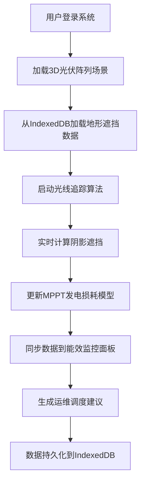

## 1. 产品概述

本项目是一个基于 React 的分布式光伏阵列阴影遮挡演化仿真平台，通过异步光线追踪算法模拟建筑物遮挡对 MPPT（最大功率点跟踪）发电效率的影响，配合 IndexedDB 存储区域地形的离线遮挡数据库，实现发电损耗数据在能效监控与运维管理系统间的实时同步，优化分布式光伏系统的跨区域调度。

### 核心价值
- 精准模拟建筑物阴影对光伏阵列发电的实时影响
- 离线化遮挡数据库支持，降低网络依赖
- 发电损耗数据跨系统实时同步
- 智能化跨区域调度优化建议

## 2. 核心功能

### 2.1 用户角色

| 角色 | 注册方式 | 核心权限 |
|------|----------|----------|
| 系统管理员 | 账号登录 | 全功能访问、系统配置、用户管理 |
| 运维工程师 | 账号登录 | 监控面板、故障排查、调度建议 |
| 数据分析师 | 账号登录 | 数据查询、报表生成、趋势分析 |

### 2.2 功能模块

1. **3D 光伏阵列仿真面板**: 实时展示光伏阵列、建筑物遮挡、阴影演化过程
2. **能效监控仪表盘**: 发电量、损耗率、MPPT 效率等关键指标实时展示
3. **运维管理中心**: 故障告警、维护调度、设备管理
4. **离线数据库管理**: IndexedDB 地形遮挡数据的导入导出与同步
5. **跨区域调度优化**: 多区域发电预测与智能调度建议

### 2.3 页面详情

| 页面名称 | 模块名称 | 功能描述 |
|---------|---------|----------|
| 仿真工作台 | 3D 场景渲染 | 基于 Three.js 的光伏阵列与建筑物 3D 可视化，支持视角控制 |
| 仿真工作台 | 光线追踪模拟 | 异步光线追踪算法实时计算阴影遮挡，动态更新发电效率 |
| 仿真工作台 | 时间演化控制 | 支持时间轴控制，模拟一天/一年中阴影变化 |
| 能效监控 | 实时数据面板 | 显示当前发电量、损耗率、温度、辐照度等指标 |
| 能效监控 | 趋势图表 | 历史发电数据趋势分析图表 |
| 运维管理 | 告警中心 | 故障告警、异常状态提示 |
| 运维管理 | 调度优化 | 基于遮挡预测的维护调度建议 |
| 数据管理 | 离线数据库 | IndexedDB 遮挡数据管理、导入导出 |
| 系统设置 | 参数配置 | 光伏组件参数、建筑物模型、地理位置配置 |

## 3. 核心流程

## 4. 用户界面设计

### 4.1 设计风格

**工业科技风 - 深色主题**
- 主色调: 深蓝色 (#0A192F) 作为背景，营造专业科技感
- 强调色: 青绿色 (#64FFDA) 用于数据高亮和交互元素
- 辅助色: 橙色 (#FF6B35) 用于告警状态，绿色 (#00C853) 用于正常状态
- 字体: JetBrains Mono 作为等宽字体用于数据展示，Inter 用于界面文本
- 布局: 深色玻璃拟态卡片，网格布局，数据可视化优先

**视觉元素**:
- 背景: 深蓝渐变 + 细微网格纹理
- 卡片: 半透明深色背景 + 微妙边框发光效果
- 图表: 霓虹风格线条，发光数据点
- 按钮: 圆角矩形，hover 时有发光效果

### 4.2 页面设计概览

| 页面名称 | 模块名称 | UI 元素 |
|---------|---------|---------|
| 仿真工作台 | 3D 场景 | 全屏 3D 画布，悬浮控制面板，数据 HUD 显示 |
| 仿真工作台 | 控制面板 | 时间轴滑块，速度控制，参数调节旋钮 |
| 能效监控 | 数据面板 | 玻璃拟态卡片网格，大型数字显示，迷你趋势图 |
| 能效监控 | 图表区域 | 多线趋势图，面积图，柱状图对比 |
| 运维管理 | 告警列表 | 时间线布局，状态色标，优先级标识 |
| 运维管理 | 调度建议 | 卡片式建议列表，执行按钮，预计收益展示 |
| 数据管理 | 数据库状态 | 存储使用量可视化，同步状态指示 |

### 4.3 响应式设计

- Desktop-first 设计，主分辨率 1920x1080
- 支持 1440p 和 4K 分辨率自适应缩放
- 侧边栏可折叠，为小屏幕提供更多内容空间
- 移动端适配：卡片纵向堆叠，简化交互

### 4.4 3D 场景指导

**环境与氛围**:
- 天空盒: 渐变天空，模拟日出到日落的光照变化
- 光照: 方向光模拟太阳光，随时间动态调整角度和强度
- 雾气: 轻微体积雾，增强空间感

**光照设置**:
- 主光源: 方向光（太阳光），动态计算太阳高度角和方位角
- 环境光: 柔和半球光，模拟天空散射
- 阴影: 软阴影，PCF 过滤，提升真实感

**相机设置**:
- 初始视角: 45度俯视，可环绕观察
- 控制: OrbitControls，支持缩放、平移、旋转
- 动画: 平滑过渡，镜头切换时的缓动效果

**交互与动画**:
- 时间流逝动画: 阴影随时间移动
- 选中高亮: 点击光伏板时的发光效果
- 数据更新: 发电效率变化时的颜色过渡

**后处理效果**:
- Bloom 发光: 高亮数据和选中元素
- 色调映射: ACES 电影级色调映射
- 轻微色差: 增强科技感

## 5. 技术约束与性能要求

- 光线追踪算法需支持 Web Worker 异步执行，避免阻塞主线程
- 3D 场景需维持 60fps 帧率，光伏板数量支持 1000+ 块
- IndexedDB 存储支持 GB 级地形数据
- 数据同步延迟 < 100ms
- 支持 PWA 离线访问
