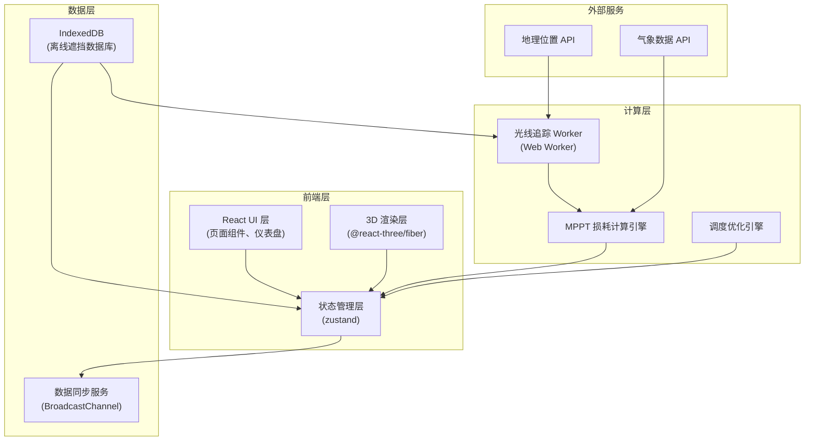
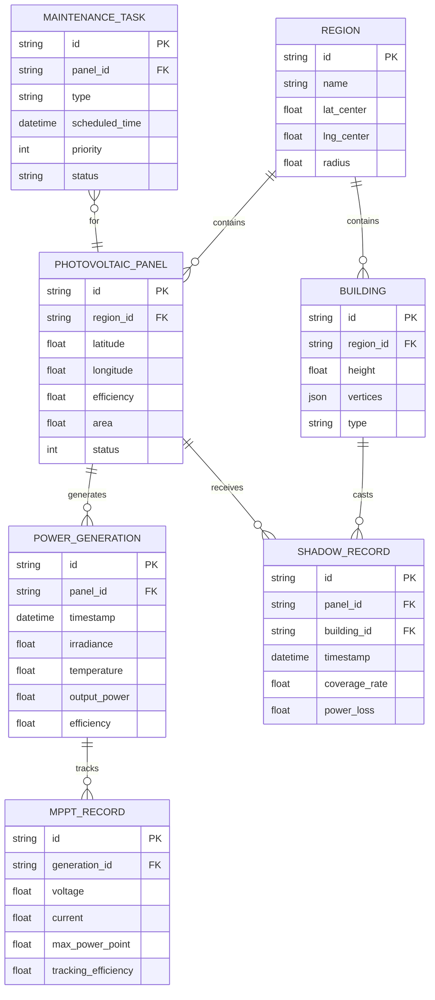

## 1. 架构设计



## 2. 技术栈说明

### 2.1 核心技术栈

| 层级 | 技术选型 | 版本 | 用途 |
|-----|---------|------|------|
| 前端框架 | React | 18.x | UI 组件开发 |
| 语言 | TypeScript | 5.x | 类型安全 |
| 构建工具 | Vite | 5.x | 构建与开发 |
| 样式 | Tailwind CSS | 3.x | 原子化 CSS |
| 3D 渲染 | Three.js | 0.160.x | 3D 场景渲染 |
| 3D React 绑定 | @react-three/fiber | 8.x | React 风格的 Three.js |
| 3D 工具库 | @react-three/drei | 9.x | 常用 3D 组件 |
| 后处理 | @react-three/postprocessing | 2.x | 后期特效 |
| 状态管理 | zustand | 4.x | 全局状态管理 |
| 图表 | recharts | 2.x | 数据可视化 |
| 图标 | lucide-react | 0.294.x | 图标库 |
| 动画 | framer-motion | 10.x | 界面动画 |

### 2.2 项目初始化

使用 `react-express-ts` 模板初始化项目：
```bash
pnpm create vite-init@latest . --template react-express-ts --force
```

## 3. 目录结构

```
src/
├── components/           # 通用组件
│   ├── ui/              # 基础 UI 组件
│   ├── dashboard/       # 仪表盘组件
│   ├── simulation/      # 仿真相关组件
│   └── layout/          # 布局组件
├── pages/               # 页面组件
│   ├── Simulation.tsx   # 仿真工作台
│   ├── Monitoring.tsx   # 能效监控
│   ├── Operation.tsx    # 运维管理
│   └── DataManage.tsx   # 数据管理
├── hooks/               # 自定义 Hooks
│   ├── useRayTracing.ts # 光线追踪 Hook
│   ├── useMPPT.ts       # MPPT 计算 Hook
│   ├── useIndexedDB.ts  # IndexedDB Hook
│   └── useSolarData.ts  # 光伏数据 Hook
├── workers/             # Web Workers
│   └── rayTracer.worker.ts  # 光线追踪 Worker
├── store/               # 状态管理
│   ├── useSimulationStore.ts
│   ├── useMonitorStore.ts
│   └── useOperationStore.ts
├── utils/               # 工具函数
│   ├── rayTracing/      # 光线追踪算法
│   ├── mppt/            # MPPT 计算
│   ├── solar/           # 太阳能相关计算
│   └── db/              # IndexedDB 封装
├── types/               # TypeScript 类型定义
│   ├── solar.ts
│   ├── simulation.ts
│   └── database.ts
└── App.tsx              # 应用入口
```

## 4. 路由定义

| 路由路径 | 页面名称 | 说明 |
|---------|---------|------|
| / | 仿真工作台 | 3D 光伏阵列仿真主界面 |
| /monitoring | 能效监控 | 发电数据监控与分析 |
| /operation | 运维管理 | 告警与调度管理 |
| /data | 数据管理 | 离线数据库管理 |
| /settings | 系统设置 | 参数配置 |

## 5. 核心数据模型

### 5.1 数据实体关系图



### 5.2 核心类型定义

```typescript
// 光伏板
interface SolarPanel {
  id: string;
  position: Vector3;
  rotation: Vector3;
  efficiency: number;
  area: number;
  status: 'normal' | 'degraded' | 'fault';
  temperature: number;
}

// 建筑物
interface Building {
  id: string;
  vertices: Vector3[];
  height: number;
  type: 'residential' | 'commercial' | 'industrial';
}

// 光线追踪结果
interface RayTracingResult {
  panelId: string;
  shadowCoverage: number;
  directIrradiance: number;
  diffuseIrradiance: number;
  timestamp: number;
}

// MPPT 数据
interface MPPTData {
  panelId: string;
  voltage: number;
  current: number;
  maxPower: number;
  trackingEfficiency: number;
  temperatureCoefficient: number;
}

// 发电记录
interface PowerGeneration {
  id: string;
  panelId: string;
  timestamp: number;
  irradiance: number;
  temperature: number;
  outputPower: number;
  theoreticalPower: number;
  lossRate: number;
}
```

## 6. 核心算法说明

### 6.1 异步光线追踪算法

1. **太阳位置计算**：基于时间和地理位置计算太阳高度角和方位角
2. **光线发射**：从太阳方向发射平行光线
3. **相交检测**：检测光线与建筑物的相交
4. **阴影计算**：计算每个光伏板的阴影覆盖率
5. **辐照度计算**：基于阴影覆盖率计算实际接收辐照度
6. **Web Worker 异步执行**：避免阻塞主线程

### 6.2 MPPT 发电损耗模型

```
实际发电功率 = 理论功率 × (1 - 阴影损耗) × (1 - 温度损耗) × MPPT效率

理论功率 = 辐照度 × 组件面积 × 组件效率
阴影损耗 = 阴影覆盖率 × 阴影损耗系数
温度损耗 = (组件温度 - 25°C) × 温度系数
```

### 6.3 跨区域调度优化算法

1. 收集各区域实时发电数据
2. 预测未来 24 小时阴影遮挡情况
3. 基于供需平衡计算最优调度方案
4. 生成维护调度建议

## 7. IndexedDB 数据库设计

### 7.1 Object Store 定义

| Store 名称 | 主键 | 索引 | 用途 |
|-----------|------|------|------|
| regions | id | name, lat_center, lng_center | 区域信息 |
| solarPanels | id | regionId, status | 光伏板数据 |
| buildings | id | regionId | 建筑物数据 |
| shadowRecords | id | panelId, timestamp | 阴影记录 |
| powerGeneration | id | panelId, timestamp | 发电记录 |
| mpptRecords | id | generationId | MPPT 记录 |
| maintenanceTasks | id | panelId, status | 维护任务 |

### 7.2 同步策略

- 实时数据：内存缓存 + 定期持久化（每 30 秒）
- 历史数据：增量同步，支持断点续传
- 冲突解决：以最新时间戳为准

## 8. 性能优化策略

1. **3D 渲染优化**：
   - InstancedMesh 批量渲染光伏板
   - 视锥体剔除
   - LOD 层次细节
   
2. **光线追踪优化**：
   - BVH 空间划分加速相交检测
   - Web Worker 多线程计算
   - 增量更新（只重新计算变化区域）

3. **数据层优化**：
   - IndexedDB 批量写入
   - 内存缓存热点数据
   - 虚拟列表处理大量数据

## 9. 安全与隐私

- 地理位置数据脱敏存储
- 发电数据加密传输
- 用户权限分级控制
- 操作日志完整记录
