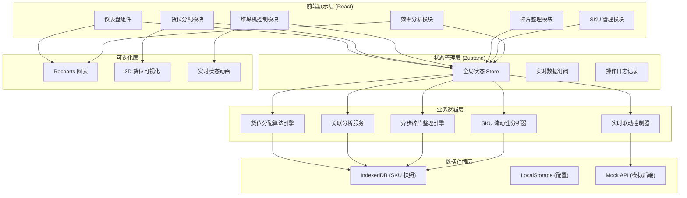

# 智能仓储管理系统（WMS）技术架构文档

## 1. 架构设计



## 2. 技术选型

### 2.1 核心技术栈
- **前端框架**：React@18 + TypeScript
- **构建工具**：Vite@5
- **样式方案**：TailwindCSS@3 + CSS 变量
- **状态管理**：Zustand（轻量级状态管理）
- **路由管理**：React Router@6
- **图表库**：Recharts@2
- **动画库**：Framer Motion
- **IndexedDB 封装**：Dexie.js
- **日期处理**：date-fns
- **图标库**：Lucide React

### 2.2 算法核心
- **货位分配算法**：基于遗传算法的多目标优化（热度、关联性、空间利用率）
- **关联分析**：FP-Growth 频繁项集挖掘算法
- **碎片整理**：贪心算法 + 动态规划的空间合并策略
- **SKU 流动性评估**：加权移动平均 + ABC 分类法

### 2.3 数据存储方案
- **IndexedDB**：存储万级 SKU 流动性快照、历史作业记录
- **LocalStorage**：用户配置、界面偏好、算法参数
- **内存缓存**：实时状态数据、当前任务队列

## 3. 目录结构

```
src/
├── components/          # 通用组件
│   ├── Layout/         # 布局组件
│   ├── ui/             # 基础 UI 组件
│   └── charts/         # 图表组件
├── pages/              # 页面组件
│   ├── Dashboard/      # 仪表盘
│   ├── Location/       # 货位分配
│   ├── Stacker/        # 堆垛机控制
│   ├── Defrag/         # 碎片整理
│   ├── SKU/            # SKU 管理
│   └── Analytics/      # 效率分析
├── store/              # 状态管理
│   ├── useWMSStore.ts
│   └── index.ts
├── engines/            # 算法引擎
│   ├── allocationEngine.ts    # 货位分配算法
│   ├── associationEngine.ts   # 关联分析引擎
│   ├── defragEngine.ts        # 碎片整理引擎
│   └── liquidityEngine.ts     # 流动性分析
├── services/           # 业务服务
│   ├── wmsService.ts
│   ├── stackerService.ts
│   └── syncService.ts
├── db/                 # 数据存储
│   ├── indexedDB.ts    # IndexedDB 封装
│   └── mockData.ts     # Mock 数据
├── types/              # TypeScript 类型定义
│   └── index.ts
├── utils/              # 工具函数
│   ├── algorithm.ts
│   └── format.ts
├── hooks/              # 自定义 Hooks
│   ├── useRealtime.ts
│   └── useDefrag.ts
├── App.tsx
├── main.tsx
└── index.css
```

## 4. 路由定义

| 路由路径 | 页面名称 | 功能说明 |
|---------|---------|---------|
| `/` | 仪表盘 | 实时监控、KPI 展示、系统概览 |
| `/location` | 货位分配 | 货位矩阵、入库作业、智能推荐 |
| `/stacker` | 堆垛机控制 | 设备状态、任务队列、实时控制 |
| `/defrag` | 碎片整理 | 碎片分布、整理引擎、进度追踪 |
| `/sku` | SKU 管理 | 流动性快照、热度分层、数据同步 |
| `/analytics` | 效率分析 | 趋势图表、对比报告、优化建议 |

## 5. 核心数据模型

### 5.1 TypeScript 类型定义

```typescript
// 货位信息
interface Location {
  id: string;
  row: number;
  col: number;
  level: number;
  status: 'empty' | 'occupied' | 'reserved' | 'defective';
  skuId?: string;
  heatLevel: number; // 热度等级 0-5
  lastAccessTime: number;
}

// SKU 信息
interface SKU {
  id: string;
  name: string;
  category: string;
  liquidityScore: number; // 流动性评分
  inCount: number;
  outCount: number;
  lastMoveTime: number;
  associatedSKUs: string[]; // 关联 SKU 列表
}

// 堆垛机设备
interface Stacker {
  id: string;
  name: string;
  status: 'idle' | 'running' | 'paused' | 'error';
  currentTask?: Task;
  efficiency: number;
  totalTasks: number;
}

// 作业任务
interface Task {
  id: string;
  type: 'inbound' | 'outbound' | 'transfer' | 'defrag';
  skuId: string;
  fromLocation?: string;
  toLocation: string;
  status: 'pending' | 'executing' | 'completed' | 'failed';
  priority: number;
  createdAt: number;
  startedAt?: number;
  completedAt?: number;
  stackerId?: string;
}

// 碎片信息
interface Fragment {
  id: string;
  locationIds: string[];
  size: number;
  wasteScore: number; // 浪费评分
  recommendation: 'merge' | 'relocate' | 'keep';
}

// 系统指标
interface Metrics {
  locationUtilization: number;
  inboundEfficiency: number;
  outboundEfficiency: number;
  avgTaskDuration: number;
  fragmentRate: number;
  timestamp: number;
}
```

### 5.2 IndexedDB 存储结构

| Store 名称 | 主键 | 索引 | 存储内容 |
|-----------|------|------|---------|
| `skus` | `id` | `category`, `liquidityScore` | SKU 基础信息 |
| `sku_snapshots` | `[skuId+timestamp]` | `skuId`, `timestamp` | SKU 流动性历史快照 |
| `locations` | `id` | `status`, `heatLevel` | 货位状态信息 |
| `tasks` | `id` | `status`, `createdAt`, `type` | 作业任务历史 |
| `metrics` | `timestamp` | `timestamp` | 历史指标数据 |

## 6. 算法引擎设计

### 6.1 货位分配算法流程

```
输入: SKU信息 + 当前货位状态 + 关联分析数据
输出: 推荐货位列表 (按优先级排序)
```

**算法步骤：**
1. 计算 SKU 流动性评分，确定热度层级
2. 查询关联 SKU 当前存储位置，优先就近分配
3. 计算候选货位的综合评分：
   - 热度匹配度 (40%)
   - 关联紧密度 (30%)
   - 空间利用率 (20%)
   - 堆垛机路径成本 (10%)
4. 返回 Top N 推荐货位

### 6.2 碎片整理引擎

```
触发条件: 碎片率 > 阈值 或 系统空闲时
整理策略: 
  1. 识别连续空闲空间 < 标准托盘尺寸的区域
  2. 计算移动成本 vs 空间收益
  3. 生成整理任务队列（低优先级）
  4. 异步执行，避免影响正常作业
```

### 6.3 实时联动机制

```
数据流:
  WMS 任务生成 → 消息队列 → 堆垛机控制模块 → 执行反馈 → WMS 更新
延迟目标: < 100ms
重连机制: 断线自动重连 + 任务补偿
```

## 7. 性能优化策略

1. **虚拟滚动**：万级 SKU 表格使用虚拟列表渲染
2. **Web Worker**：复杂算法计算在 Worker 线程执行
3. **请求防抖**：高频数据更新合并处理
4. **增量更新**：图表数据只更新变化部分
5. **IndexedDB 索引优化**：常用查询字段建立索引
6. **懒加载**：页面组件按需加载
