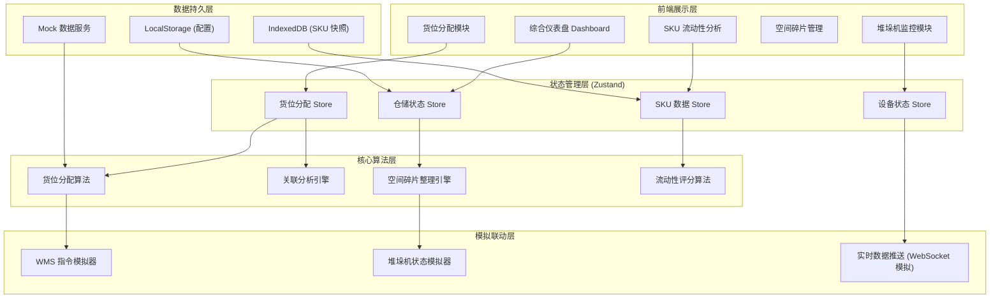

## 1. 架构设计



## 2. 技术描述

- **前端框架**: React@18 + TypeScript + Vite@5
- **状态管理**: Zustand@4
- **路由管理**: react-router-dom@6
- **样式方案**: TailwindCSS@3 + 自定义 CSS 变量
- **图表可视化**: Recharts@2
- **图标库**: lucide-react@0.400
- **IndexedDB 封装**: idb@8
- **工具函数**: date-fns@3 + lodash-es@4

## 3. 路由定义

| 路由 | 页面组件 | 用途 |
|------|----------|------|
| /dashboard | DashboardPage | 综合仪表盘 - 仓储状态总览 |
| /allocation | AllocationPage | 货位分配 - 入库作业与关联分析 |
| /stacker | StackerPage | 堆垛机监控 - 设备状态与实时联动 |
| /space | SpacePage | 空间管理 - 碎片检测与整理 |
| /sku | SkuPage | SKU 分析 - 流动性快照与趋势 |

## 4. 数据模型

### 4.1 核心数据结构

```typescript
// 货位信息
interface Location {
  id: string;
  aisle: number;
  rack: number;
  level: number;
  slot: number;
  status: 'empty' | 'occupied' | 'reserved' | 'maintenance';
  capacity: number;
  usedCapacity: number;
  heatLevel: number; // 0-100 热度等级
  skuId?: string;
}

// SKU 信息
interface SKU {
  id: string;
  name: string;
  category: string;
  dimensions: { length: number; width: number; height: number };
  weight: number;
  turnoverRate: number; // 周转率
  lastInbound: Date;
  lastOutbound: Date;
  liquidityScore: number; // 0-100 流动性评分
}

// 堆垛机状态
interface Stacker {
  id: string;
  name: string;
  status: 'idle' | 'running' | 'paused' | 'fault' | 'maintenance';
  currentTask?: string;
  currentPosition: { aisle: number; rack: number; level: number };
  taskQueue: StackerTask[];
  efficiency: number; // 作业效率 0-100
  totalTasks: number;
  completedTasks: number;
}

// 入库任务
interface InboundTask {
  id: string;
  skuId: string;
  quantity: number;
  status: 'pending' | 'allocating' | 'allocated' | 'executing' | 'completed';
  allocatedLocation?: string;
  stackerId?: string;
  createdAt: Date;
  completedAt?: Date;
}

// 空间碎片信息
interface FragmentationInfo {
  locationId: string;
  fragmentType: 'single' | 'cluster' | 'aisle';
  severity: 'low' | 'medium' | 'high';
  wastedCapacity: number;
  recommendedAction: 'consolidate' | 'reallocate' | 'defrag';
}
```

### 4.2 IndexedDB 存储结构

| Object Store | 主键 | 索引 | 用途 |
|--------------|------|------|------|
| sku_snapshots | id | category, liquidityScore, turnoverRate | SKU 流动性快照 |
| location_states | id | aisle, rack, status, heatLevel | 货位状态快照 |
| operation_logs | id | timestamp, type, skuId | 操作日志 |
| efficiency_metrics | id | timestamp, metricType | 效率指标历史 |

## 5. 核心算法模块

### 5.1 货位分配算法

**算法输入**:
- SKU 信息（尺寸、重量、流动性评分）
- 关联分析结果（共置 SKU 列表）
- 当前货位状态
- 设备负载情况

**分配策略**:
1. **流动性优先**: 高流动性 SKU 分配至出入口附近
2. **关联优先**: 关联度高的 SKU 尽量相邻放置
3. **尺寸适配**: 货位空间利用率最大化
4. **负载均衡**: 各巷道/货架负载均衡

### 5.2 空间碎片整理引擎

**检测机制**:
- 定时扫描货位状态
- 计算碎片化指数 = 零散空位数 / 总空位数
- 识别连续空闲区域

**整理策略**:
- 异步执行，不影响正常作业
- 优先级排序：高严重度 → 低严重度
- 最小移动原则：减少搬运次数

### 5.3 SKU 关联分析

**分析维度**:
- 历史出库订单中的同时出现频率
- 品类相关性
- 存储条件相似度

**输出**:
- SKU 关联度矩阵
- 推荐共置 SKU 列表

## 6. 项目结构

```
src/
├── components/           # 可复用组件
│   ├── dashboard/       # 仪表盘组件
│   ├── allocation/      # 货位分配组件
│   ├── stacker/         # 堆垛机监控组件
│   ├── space/           # 空间管理组件
│   ├── sku/             # SKU 分析组件
│   └── common/          # 通用组件
├── pages/               # 页面组件
│   ├── DashboardPage.tsx
│   ├── AllocationPage.tsx
│   ├── StackerPage.tsx
│   ├── SpacePage.tsx
│   └── SkuPage.tsx
├── store/               # Zustand 状态管理
│   ├── useWarehouseStore.ts
│   ├── useAllocationStore.ts
│   ├── useStackerStore.ts
│   └── useSkuStore.ts
├── algorithms/          # 核心算法
│   ├── locationAllocation.ts
│   ├── fragmentationEngine.ts
│   ├── associationAnalysis.ts
│   └── liquidityScoring.ts
├── db/                  # 数据持久化
│   ├── indexedDB.ts
│   └── mockData.ts
├── hooks/               # 自定义 Hooks
│   ├── useRealTimeData.ts
│   ├── useLocationHeatmap.ts
│   └── useEfficiencyMetrics.ts
├── types/               # TypeScript 类型定义
│   └── index.ts
├── utils/               # 工具函数
│   ├── formatters.ts
│   └── validators.ts
├── App.tsx
├── main.tsx
└── index.css
```
