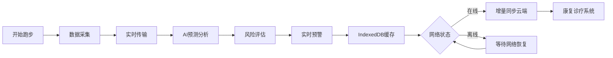

## 1. 产品概述

长跑运动损伤风险监控系统是一款基于Vue 3的智能运动健康监测平台，通过足底压力、步频周期和姿态畸变分析，实现运动损伤风险的实时预警和个性化康复指导。

- 核心价值：通过多维度运动数据采集与AI预测模型，帮助跑者预防运动损伤，延长跑鞋使用寿命
- 目标用户：长跑爱好者、专业运动员、运动康复医师

## 2. 核心功能

### 2.1 用户角色
| 角色 | 注册方式 | 核心权限 |
|------|----------|----------|
| 普通跑者 | 手机号/邮箱注册 | 数据监测、风险预警、历史记录查看 |
| 康复医师 | 专业资质认证 | 患者数据查看、诊疗方案制定、康复追踪 |
| 系统管理员 | 后台授权 | 用户管理、系统配置、数据分析 |

### 2.2 功能模块
1. **实时监测终端**：足底压力热图、步频周期波形、姿态畸变实时显示
2. **康复诊疗系统**：损伤风险评估、康复方案推荐、恢复进度追踪
3. **AI预测中心**：疲劳状态实时反馈、姿态畸变预测、损伤风险分级
4. **跑鞋管理**：磨损监测、使用寿命预测、更换提醒
5. **数据同步中心**：IndexedDB离线存储、跨端增量同步、数据链溯源

### 2.3 页面详情
| 页面名称 | 模块名称 | 功能描述 |
|---------|----------|----------|
| 实时监测页 | 数据仪表盘 | 实时显示足底压力分布、步频数据、姿态角度 |
| 实时监测页 | 风险预警条 | 疲劳状态指示器、损伤风险等级、即时建议 |
| 损伤评估页 | 风险分析报告 | 多维度损伤风险评分、热力图可视化 |
| 损伤评估页 | 康复方案 | 个性化训练建议、康复动作指导 |
| 跑鞋管理页 | 磨损监测 | 鞋底各区域磨损程度可视化、剩余寿命预测 |
| 跑鞋管理页 | 同步状态 | IndexedDB同步进度、离线数据缓存状态 |
| 历史分析页 | 数据趋势 | 长期运动数据趋势、损伤风险变化曲线 |
| 历史分析页 | 报告导出 | 数据报告生成、PDF导出功能 |

## 3. 核心流程

用户佩戴监测设备开始跑步 → 设备采集足底压力和姿态数据 → 数据实时传输到监测终端 → AI模型进行姿态畸变预测和疲劳分析 → 系统计算损伤风险等级 → 实时反馈预警信息 → 数据缓存到IndexedDB → 网络恢复时增量同步到云端 → 康复医师可查看分析数据并制定诊疗方案

## 4. 用户界面设计

### 4.1 设计风格
- 主色调：科技蓝 (#165DFF) + 活力橙 (#FF7D00)
- 辅助色：成功绿 (#00B42A)、警告黄 (#FF7D00)、危险红 (#F53F3F)
- 字体：Display字体使用 Orbitron，正文字体使用 Noto Sans SC
- 按钮风格：圆角8px，微立体阴影，悬停时有轻微上浮动画
- 布局风格：卡片式布局，网格化数据展示，大面积深色背景配亮色数据可视化
- 图标风格：线性图标，科技感线条，动态数据可视化图表

### 4.2 页面设计概览
| 页面名称 | 模块名称 | UI元素 |
|---------|----------|--------|
| 实时监测页 | 数据仪表盘 | 足底压力热图（Canvas渲染）、步频波形图（ECharts）、姿态3D模型、渐变色彩编码、数据跳动动画 |
| 损伤评估页 | 风险分析 | 雷达图评分、环形进度条、分级卡片、渐变背景、滚动触发动画 |
| 跑鞋管理页 | 磨损监测 | 鞋底3D模型、区域着色显示磨损程度、时间轴同步进度、加载动画 |

### 4.3 响应式设计
- 桌面端优先（1920px），适配平板（768px）和移动端（375px）
- 移动端采用底部导航，数据图表自适应缩放
- 触控区域不小于44px，支持手势滑动切换页面

### 4.4 3D场景指导
- 环境：深色科技感背景，蓝色调HDRI环境贴图
- 光照：三点布光，主光+补光+轮廓光，突出数据可视化效果
- 相机：姿态监测采用正交视角，跑鞋模型采用可旋转透视视角
- 交互：鼠标拖拽旋转模型，滚轮缩放，悬停显示详细数据
- 动画：数据更新时平滑过渡，风险等级变化时有颜色渐变动画
