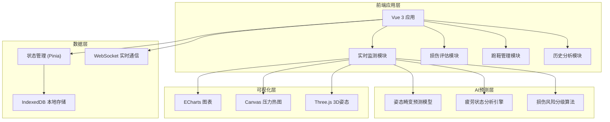
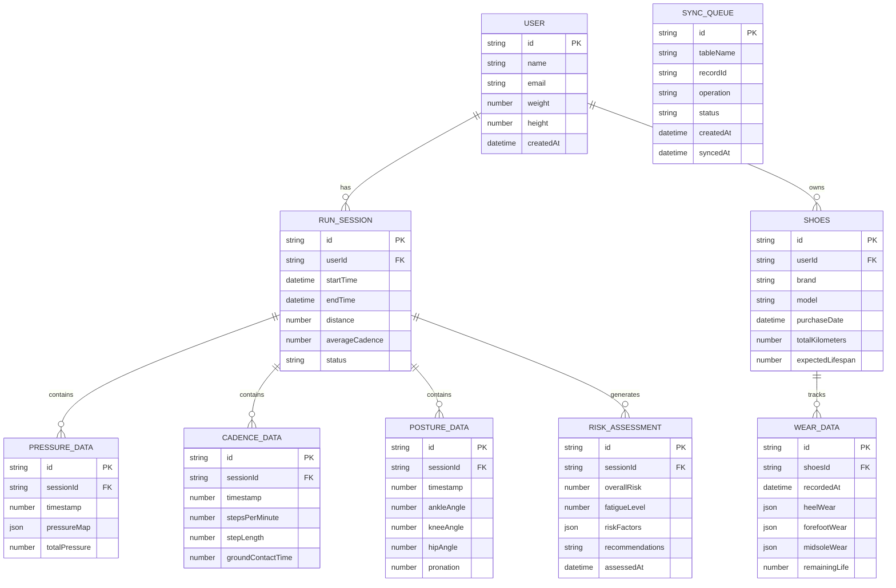

## 1. 架构设计



## 2. 技术描述

- 前端框架：Vue 3.4 + TypeScript 5.0 + Vite 5.0
- 状态管理：Pinia 2.1
- 路由：Vue Router 4.3
- UI框架：Element Plus 2.6
- 数据可视化：ECharts 5.5 + Three.js 0.162
- 本地存储：IndexedDB (idb 8.0)
- 实时通信：WebSocket (原生API)
- 工具库：Lodash 4.17 + Day.js 1.11
- 样式方案：SCSS + CSS Variables
- 代码规范：ESLint + Prettier

## 3. 路由定义

| 路由路径 | 页面名称 | 功能说明 |
|---------|----------|----------|
| / | 首页仪表盘 | 数据概览、快捷入口、实时状态 |
| /monitor | 实时监测 | 足底压力、步频数据、姿态监测、风险预警 |
| /assessment | 损伤评估 | 风险分析报告、康复方案推荐 |
| /shoes | 跑鞋管理 | 磨损监测、寿命预测、同步状态 |
| /history | 历史分析 | 数据趋势、报告导出 |
| /settings | 系统设置 | 用户配置、设备管理、同步设置 |

## 4. 数据模型

### 4.1 数据模型定义



### 4.2 IndexedDB Store 设计

| Store名称 | 主键 | 索引 | 用途 |
|-----------|------|------|------|
| users | id | email | 用户信息 |
| runSessions | id | userId, startTime | 跑步会话 |
| pressureData | id | sessionId, timestamp | 足底压力数据 |
| cadenceData | id | sessionId, timestamp | 步频数据 |
| postureData | id | sessionId, timestamp | 姿态数据 |
| riskAssessments | id | sessionId, assessedAt | 风险评估 |
| shoes | id | userId, purchaseDate | 跑鞋信息 |
| wearData | id | shoesId, recordedAt | 磨损数据 |
| syncQueue | id | tableName, status, createdAt | 同步队列 |

## 5. 核心算法模块

### 5.1 异步姿态畸变预测模型
```typescript
interface PosturePrediction {
  timestamp: number;
  predictedAngles: {
    ankle: number;
    knee: number;
    hip: number;
  };
  distortionProbability: number;
  confidence: number;
}

// 使用LSTM时序预测模型进行姿态畸变预测
// 输入：历史姿态序列(窗口大小=50)
// 输出：未来10帧的姿态畸变概率
```

### 5.2 疲劳状态实时反馈算法
```typescript
interface FatigueState {
  level: 'low' | 'moderate' | 'high' | 'critical';
  score: number;
  factors: {
    cadenceVariation: number;
    pressureDistribution: number;
    postureStability: number;
    groundContactTime: number;
  };
  recommendations: string[];
}
```

### 5.3 跑鞋磨损增量同步算法
```typescript
interface WearSyncState {
  lastSyncTimestamp: number;
  pendingRecords: number;
  syncProgress: number;
  conflicts: Array<{
    recordId: string;
    localVersion: any;
    remoteVersion: any;
    resolution: 'local' | 'remote' | 'manual';
  }>;
}
```
