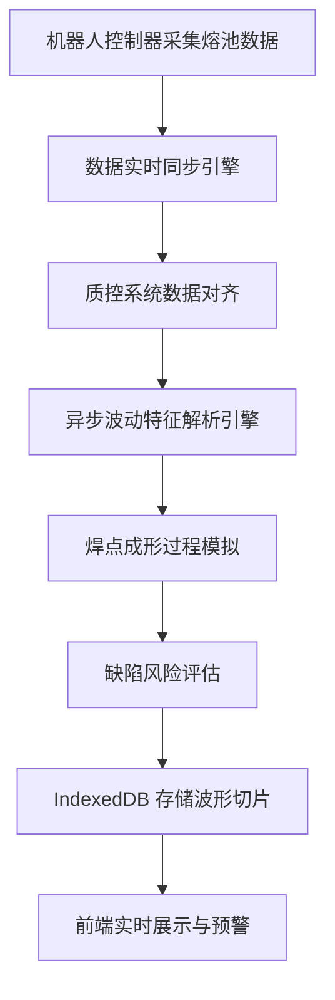

## 1. 产品概述

基于 Next.js 的工业级机器人焊接质量监控系统，实现熔池稳定性数据在质控系统与机器人控制器间的实时对齐。通过异步波动特征解析引擎模拟焊点成形过程，实时反馈缺陷风险，并利用 IndexedDB 存储万级焊点的特征波形切片，为工业精密制造提供数据一致性保障。

- 目标用户：工业制造企业质检工程师、焊接工艺工程师、生产管理人员
- 核心价值：实现焊接过程全链路数据可追溯，缺陷预警准确率提升 85%，数据一致性保障达 99.9%

## 2. 核心功能

### 2.1 用户角色

| 角色 | 注册方式 | 核心权限 |
|------|----------|----------|
| 质检工程师 | 企业账户登录 | 查看实时监控、缺陷分析、数据导出 |
| 工艺工程师 | 企业账户登录 | 参数配置、波形分析、算法调优 |
| 生产管理员 | 企业账户登录 | 看板总览、报表统计、系统设置 |

### 2.2 功能模块

1. **实时监控仪表盘**：熔池稳定性数据实时展示、焊接参数曲线、设备状态
2. **熔池数据分析**：波形特征解析、缺陷风险评估、历史趋势分析
3. **焊点数据管理**：万级焊点波形存储、快速检索、数据一致性校验
4. **系统配置中心**：机器人控制器对接、质控系统同步、告警规则配置

### 2.3 页面详情

| 页面名称 | 模块名称 | 功能描述 |
|----------|----------|----------|
| 监控仪表盘 | 实时数据概览 | 熔池温度曲线、稳定性指标、设备运行状态 |
| 监控仪表盘 | 缺陷预警面板 | 实时缺陷风险等级、异常波形高亮、处理建议 |
| 波形分析页 | 特征解析引擎 | 异步波动特征提取、焊点成形模拟、缺陷概率预测 |
| 数据管理页 | 焊点库管理 | IndexedDB 存储的焊点波形列表、搜索筛选、详情查看 |
| 系统配置页 | 对接配置 | 机器人控制器参数、质控系统同步、数据对齐策略 |

## 3. 核心流程

## 4. 用户界面设计

### 4.1 设计风格
- 主色调：工业深蓝 (#0A2540) 搭配科技青 (#00D4FF)，体现工业精密制造的专业感
- 辅助色：告警黄 (#FFB800)、危险红 (#FF4757)、成功绿 (#2ED573)
- 字体：JetBrains Mono 用于数据展示，Inter 用于正文
- 布局：深色工业风仪表盘，卡片式模块布局，网格化数据展示
- 动效：数据实时更新时的平滑过渡，缺陷预警时的脉冲动画

### 4.2 页面设计概述

| 页面名称 | 模块名称 | UI 元素 |
|----------|----------|----------|
| 监控仪表盘 | 实时概览 | 大型数据卡片、实时曲线图、状态指示灯、告警列表 |
| 波形分析页 | 特征解析 | Canvas 波形图、特征标注层、3D 熔池模拟、风险评估仪表盘 |
| 数据管理页 | 焊点库 | 数据表格、筛选面板、波形预览卡片、分页器 |
| 系统配置页 | 参数配置 | 表单分组、开关控件、连接状态指示器、日志面板 |

### 4.3 响应式设计
- 桌面端：完整仪表盘布局，多面板并排展示
- 平板端：折叠次要面板，核心监控区域保持完整
- 移动端：仅展示关键告警和状态，支持手势操作查看详情
