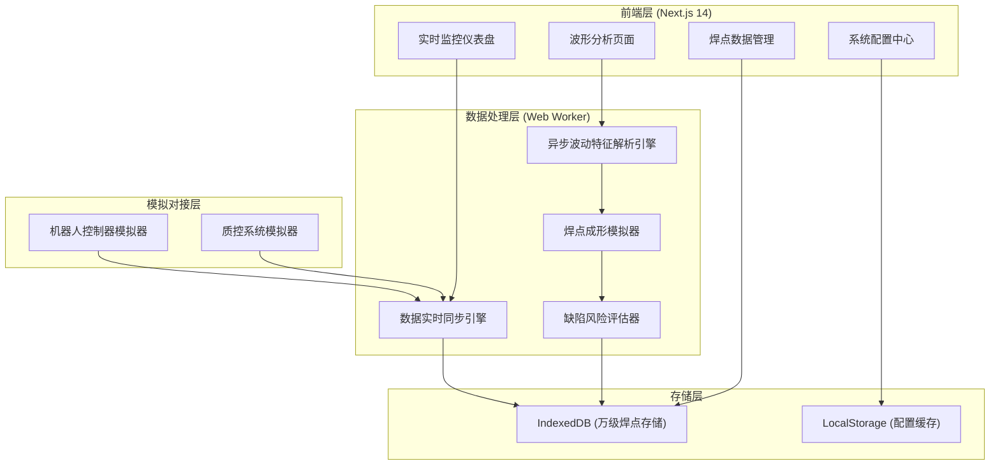

## 1. 架构设计



## 2. 技术栈说明

- **前端框架**：Next.js 14 (App Router) + TypeScript
- **样式方案**：TailwindCSS 3
- **图表可视化**：Chart.js + Canvas API（高性能波形渲染）
- **状态管理**：Zustand（轻量级状态管理）
- **本地存储**：IndexedDB (idb 库) 存储万级焊点波形数据
- **异步处理**：Web Workers 实现特征解析引擎
- **动画库**：Framer Motion（交互动画）
- **图标**：Lucide React

## 3. 路由定义

| 路由 | 页面用途 |
|------|----------|
| /dashboard | 实时监控仪表盘 - 熔池数据、缺陷预警、设备状态 |
| /analysis | 波形分析页面 - 特征解析、焊点模拟、风险评估 |
| /welds | 焊点数据管理 - 焊点库、搜索、详情查看 |
| /settings | 系统配置中心 - 对接参数、告警规则、数据同步配置 |

## 4. 数据模型

### 4.1 IndexedDB 数据模型

```typescript
// 焊点波形数据
interface WeldPoint {
  id: string;
  timestamp: number;
  robotId: string;
  weldProgram: string;
  poolTemperature: number[];
  current: number[];
  voltage: number[];
  oscillation: number[];
  stabilityIndex: number;
  defectRisk: 'low' | 'medium' | 'high';
  defectType?: string;
  features: WaveformFeatures;
}

// 波形特征
interface WaveformFeatures {
  peakCount: number;
  avgAmplitude: number;
  frequency: number;
  riseTime: number;
  decayTime: number;
  harmonics: number[];
}

// 实时监控数据
interface RealTimeData {
  timestamp: number;
  robotId: string;
  poolTemp: number;
  current: number;
  voltage: number;
  stability: number;
  status: 'normal' | 'warning' | 'error';
}

// 系统配置
interface SystemConfig {
  robotControllers: RobotController[];
  qualitySystem: QualitySystemConfig;
  alertRules: AlertRule[];
}
```

### 4.2 IndexedDB 存储结构

| Object Store | 主键 | 索引 | 用途 |
|--------------|------|------|------|
| weldPoints | id | timestamp, robotId, defectRisk, stabilityIndex | 存储焊点波形数据 |
| realtimeData | timestamp | robotId, status | 实时监控数据缓存 |
| systemConfig | key | - | 系统配置存储 |

## 5. 核心模块说明

### 5.1 数据实时同步引擎
- Web Worker 独立线程运行
- 模拟机器人控制器数据推送（50ms 间隔）
- 质控系统数据对齐（时间戳校准）
- 数据一致性校验机制

### 5.2 异步波动特征解析引擎
- 基于 FFT 的频域分析
- 波形特征实时提取
- 焊点成形过程模拟
- 缺陷模式识别与风险评估

### 5.3 IndexedDB 高性能存储
- 批量写入优化
- 分页查询支持
- 索引加速检索
- 存储空间管理（LRU 淘汰策略）

### 5.4 波形可视化组件
- Canvas 高性能渲染（支持 10000+ 数据点）
- 特征区域高亮标注
- 缩放与拖拽交互
- 多波形叠加对比
