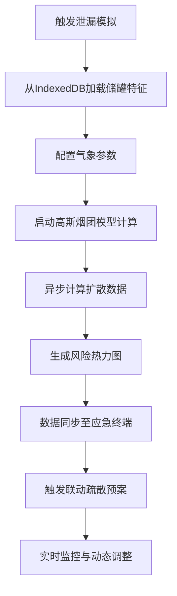
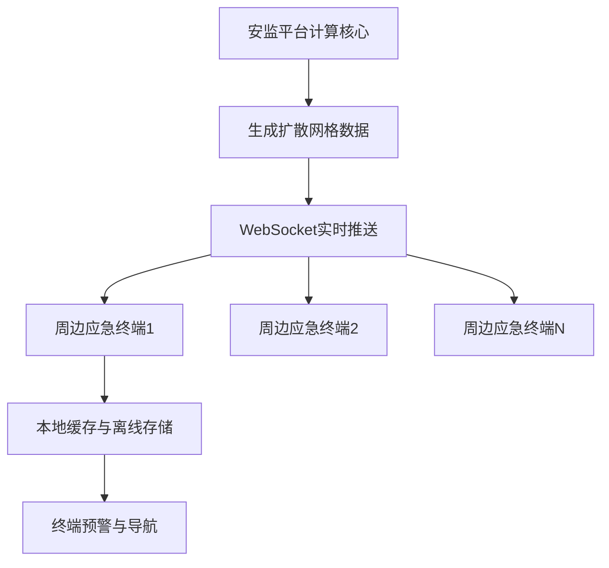

## 1. 产品概述

危化品储罐区泄漏演化模拟系统，基于 Vue 3 实现有毒云团扩散数据在安监平台与周边应急终端间的实时映射。系统利用异步高斯烟团修正模型预测风险覆盖面，支持多系统联动疏散，配合 IndexedDB 存储罐区各维度的物理特征库，显著提升化学工业园区的协同预警能力。

### 产品目标
- 模拟危化品泄漏后的云团扩散演化过程
- 实现安监平台与应急终端的数据实时同步
- 提供可视化的风险区域预测与疏散路径规划
- 支持离线数据存储与快速检索

### 目标用户
- 安监部门监控人员
- 工业园区应急管理团队
- 周边企业应急响应人员
- 消防救援指挥人员

## 2. 核心功能

### 2.1 用户角色

| 角色 | 核心权限 |
|------|----------|
| 安监管理员 | 全功能访问、参数配置、历史数据管理 |
| 应急指挥 | 实时监控、疏散指令发布、资源调度 |
| 终端用户 | 接收预警信息、查看疏散路径、上报状态 |

### 2.2 功能模块

1. **安监平台主界面**：储罐区可视化地图、实时泄漏监控面板、云团扩散热力图
2. **高斯烟团模拟模块**：扩散参数配置、异步计算引擎、风险等级评估
3. **IndexedDB 存储模块**：储罐物理特征库、历史泄漏记录、气象参数库
4. **应急终端模拟**：多终端预警推送、疏散路径导航、状态反馈
5. **联动疏散系统**：疏散路线规划、资源调度、多部门协同

### 2.3 页面详情

| 页面名称 | 模块名称 | 功能描述 |
|---------|----------|----------|
| 安监监控大屏 | 储罐区地图 | Canvas 可视化渲染、储罐状态监测、泄漏点定位 |
| 安监监控大屏 | 云团扩散图层 | 高斯烟团模型渲染、风险等级热力图、时间轴动画 |
| 安监监控大屏 | 数据面板 | 实时气象数据、泄漏源参数、扩散预测数据 |
| 参数配置页 | 泄漏源配置 | 危化品种类、泄漏速率、储罐位置、泄漏时间 |
| 参数配置页 | 气象参数 | 风速、风向、温度、湿度、大气稳定度 |
| 参数配置页 | 储罐特征库 | IndexedDB 数据管理、储罐物理属性增删改查 |
| 应急终端页 | 预警信息 | 多终端模拟、预警等级、影响范围 |
| 应急终端页 | 疏散导航 | 最优疏散路径、避难所位置、实时路况 |
| 联动指挥页 | 资源调度 | 救援力量分布、物资调配、多部门协同 |
| 联动指挥页 | 历史回放 | 泄漏演化过程回放、数据分析、预案评估 |

## 3. 核心流程

### 3.1 泄漏模拟流程

### 3.2 数据同步流程

## 4. 用户界面设计

### 4.1 设计风格

**工业科技风**，以深色主题为基底，配合高亮警示色，营造专业、严肃的监控系统氛围。

- **主色调**：深蓝色 (#0A1628) 作为背景，营造专业监控感
- **警示色系**：红色 (#FF4757)、橙色 (#FF7F50)、黄色 (#FFD700)、绿色 (#2ED573) 代表不同风险等级
- **点缀色**：科技蓝 (#00D9FF) 用于数据可视化和交互元素
- **字体**：采用等宽字体 (JetBrains Mono) 用于数据展示，无衬线字体 (Noto Sans SC) 用于标题和正文
- **布局**：网格化布局，多面板分屏显示，支持拖拽调整
- **图标**：采用线性风格图标，配合发光效果增强科技感

### 4.2 页面设计概览

| 页面名称 | 模块名称 | UI 元素 |
|---------|----------|---------|
| 安监监控大屏 | 储罐区地图 | 深色底图、发光储罐标记、脉冲动画泄漏点、渐变热力图层 |
| 安监监控大屏 | 数据面板 | 半透明玻璃态卡片、实时数据滚动、状态指示灯、趋势图表 |
| 参数配置页 | 表单区域 | 深色表单控件、滑动条、下拉选择、实时预览 |
| 应急终端页 | 移动端模拟 | 手机边框、通知弹窗、地图导航、紧急按钮 |
| 联动指挥页 | 调度面板 | 资源卡片、时间线、协同状态指示灯 |

### 4.3 响应式设计

- **桌面端优先**：针对 1920×1080 及以上分辨率优化，支持多面板分屏
- **平板适配**：1024px 断点，面板自动堆叠，优化触控交互
- **移动端**：应急终端页面模拟手机端体验，针对 375px 宽度优化

### 4.4 动效设计

- **云团扩散**：使用 Canvas 实现粒子系统，模拟云团随风扩散的流畅动画
- **预警脉冲**：泄漏点和高风险区域采用呼吸灯脉冲效果
- **数据刷新**：数值变化时采用平滑过渡动画
- **页面切换**：采用淡入淡出 + 滑动过渡效果
- **告警闪烁**：紧急预警信息采用红色闪烁提醒
