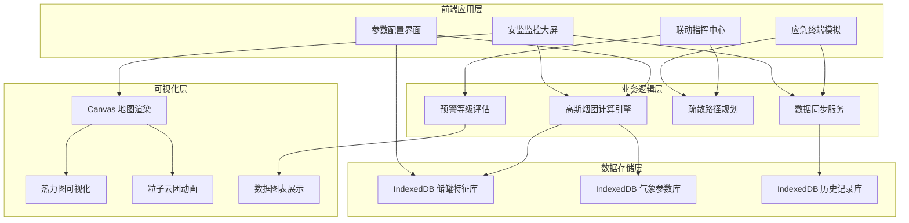

## 1. 架构设计



## 2. 技术栈说明

### 2.1 核心框架
- **前端框架**：Vue 3.4 + Composition API + `<script setup>`
- **开发语言**：TypeScript 5.3
- **构建工具**：Vite 5.0
- **路由管理**：Vue Router 4.3
- **状态管理**：Pinia 2.1

### 2.2 可视化与动画
- **Canvas 渲染**：原生 Canvas 2D API 实现高性能地图和粒子系统
- **热力图**：自定义热力图算法，基于高斯分布渲染风险区域
- **动画库**：GSAP 3.12 用于复杂时间轴动画
- **图表库**：ECharts 5.4 用于数据趋势展示

### 2.3 数据存储
- **浏览器数据库**：IndexedDB (使用 idb 库封装)
- **本地缓存**：localStorage 存储用户配置

### 2.4 样式方案
- **CSS 方案**：Tailwind CSS 3.4
- **CSS 预处理器**：Sass / SCSS
- **CSS 变量**：主题色和全局样式变量管理

### 2.5 工具库
- **工具函数**：Lodash-es
- **日期处理**：Day.js
- **ID 生成**：nanoid

## 3. 目录结构

```
src/
├── assets/              # 静态资源
│   ├── styles/          # 全局样式
│   │   ├── main.scss    # 主样式入口
│   │   ├── variables.scss # CSS变量
│   │   └── animations.scss # 动画定义
│   └── fonts/           # 字体文件
├── components/          # 公共组件
│   ├── common/          # 通用组件
│   │   ├── DataCard.vue
│   │   ├── StatusIndicator.vue
│   │   └── GaugeMeter.vue
│   ├── map/             # 地图相关组件
│   │   ├── TankMap.vue
│   │   ├── HeatmapLayer.vue
│   │   └── ParticleCloud.vue
│   ├── terminal/        # 终端模拟组件
│   │   ├── PhoneFrame.vue
│   │   └── AlertPopup.vue
│   └── charts/          # 图表组件
│       └── TrendChart.vue
├── composables/         # 组合式函数
│   ├── useGaussianPlume.ts # 高斯烟团模型
│   ├── useIndexedDB.ts  # IndexedDB操作
│   ├── useMapRenderer.ts # 地图渲染
│   └── useWebSocket.ts  # WebSocket模拟
├── stores/              # Pinia状态管理
│   ├── tankStore.ts     # 储罐数据状态
│   ├── simulationStore.ts # 模拟状态
│   └── terminalStore.ts # 终端状态
├── types/               # TypeScript类型定义
│   ├── tank.ts          # 储罐相关类型
│   ├── simulation.ts    # 模拟相关类型
│   └── terminal.ts      # 终端相关类型
├── utils/               # 工具函数
│   ├── gaussian.ts      # 高斯计算函数
│   ├── coordinates.ts   # 坐标转换
│   └── db.ts            # 数据库操作封装
├── views/               # 页面视图
│   ├── MonitorView.vue  # 安监监控大屏
│   ├── ConfigView.vue   # 参数配置页
│   ├── TerminalView.vue # 应急终端页
│   └── CommandView.vue  # 联动指挥页
├── router/              # 路由配置
│   └── index.ts
├── App.vue
└── main.ts
```

## 4. 核心数据模型

### 4.1 储罐物理特征

```typescript
interface Tank {
  id: string;
  name: string;
  chemical: string;           // 危化品名称
  capacity: number;           // 容量 (m³)
  currentVolume: number;      // 当前存量 (m³)
  position: {
    x: number;                // 地图坐标X
    y: number;                // 地图坐标Y
  };
  diameter: number;           // 直径 (m)
  height: number;             // 高度 (m)
  pressure: number;           // 内部压力 (MPa)
  temperature: number;        // 温度 (°C)
  toxicityLevel: 'low' | 'medium' | 'high' | 'extreme'; // 毒性等级
  material: string;           // 材质
  lastInspection: string;     // 上次检测日期
  status: 'normal' | 'warning' | 'leaking' | 'critical';
}
```

### 4.2 高斯烟团参数

```typescript
interface GaussianParams {
  sourceStrength: number;     // 源强 (kg/s)
  releaseHeight: number;      // 释放高度 (m)
  windSpeed: number;          // 风速 (m/s)
  windDirection: number;      // 风向 (度，0-360)
  temperature: number;        // 环境温度 (°C)
  humidity: number;           // 相对湿度 (%)
  atmosphericStability: 'A' | 'B' | 'C' | 'D' | 'E' | 'F'; // 大气稳定度
  diffusionCoefficient: number; // 扩散系数
  decayRate: number;          // 衰减率
}
```

### 4.3 扩散计算结果

```typescript
interface DiffusionResult {
  timestamp: number;
  gridSize: {
    width: number;
    height: number;
    resolution: number;        // 网格分辨率 (m/px)
  };
  origin: {
    x: number;
    y: number;
  };
  concentrationGrid: number[][]; // 浓度网格
  riskZones: RiskZone[];
  maxConcentration: number;
  affectedArea: number;         // 受影响面积 (m²)
}

interface RiskZone {
  level: 'safe' | 'caution' | 'warning' | 'danger' | 'extreme';
  concentration: number;        // 浓度阈值
  color: string;
  polygon: { x: number; y: number }[];
}
```

### 4.4 应急终端数据

```typescript
interface EmergencyTerminal {
  id: string;
  name: string;
  type: 'enterprise' | 'residential' | 'school' | 'hospital';
  position: {
    x: number;
    y: number;
  };
  population: number;
  alertLevel: 'normal' | 'alert' | 'evacuate' | 'shelter';
  evacuationStatus: 'idle' | 'preparing' | 'evacuating' | 'completed';
  receivedTime?: number;
  completedTime?: number;
  evacuationRoute?: RoutePoint[];
}

interface RoutePoint {
  x: number;
  y: number;
  type: 'start' | 'waypoint' | 'shelter' | 'danger';
}
```

### 4.5 IndexedDB 存储结构

| 数据库名 | 对象仓库 | 主键 | 索引 | 存储内容 |
|---------|----------|------|------|----------|
| tank_nexust_db | tanks | id | name, chemical, status | 储罐物理特征 |
| tank_nexust_db | chemicals | id | name, toxicity | 危化品属性库 |
| tank_nexust_db | weather_records | id | timestamp | 气象历史数据 |
| tank_nexust_db | simulation_records | id | startTime, tankId | 模拟历史记录 |
| tank_nexust_db | terminals | id | type, alertLevel | 应急终端信息 |
| tank_nexust_db | evacuation_routes | id | terminalId | 疏散路径配置 |

## 5. 核心算法实现

### 5.1 高斯烟团修正模型

基于经典高斯烟团模型，考虑以下修正因素：
1. 大气稳定度修正系数
2. 地形影响因子
3. 化学物质衰减系数
4. 风速垂直廓线修正
5. 地面反射系数

核心计算公式：
```
C(x,y,z,t) = (Q / (2π)^(3/2) * σ_y * σ_z * u) * 
             exp(-(y²)/(2σ_y²)) * 
             [exp(-(z-H)²/(2σ_z²)) + exp(-(z+H)²/(2σ_z²))] *
             exp(-λ*t)
```

### 5.2 扩散参数计算

根据 Pasquill-Gifford 扩散参数曲线，使用经验公式计算 σ_y 和 σ_z：
- σ_y = a * x^b （横向扩散参数）
- σ_z = c * x^d （垂直扩散参数）

其中 a, b, c, d 根据大气稳定度等级取值。

## 6. 路由定义

| 路由路径 | 页面名称 | 说明 |
|---------|----------|------|
| / | 安监监控大屏 | 默认首页，展示储罐区实时监控 |
| /monitor | 安监监控大屏 | 同首页 |
| /config | 参数配置页 | 储罐管理、参数配置、数据库管理 |
| /terminal | 应急终端页 | 模拟多个周边应急终端 |
| /command | 联动指挥页 | 疏散指挥、资源调度、历史回放 |
