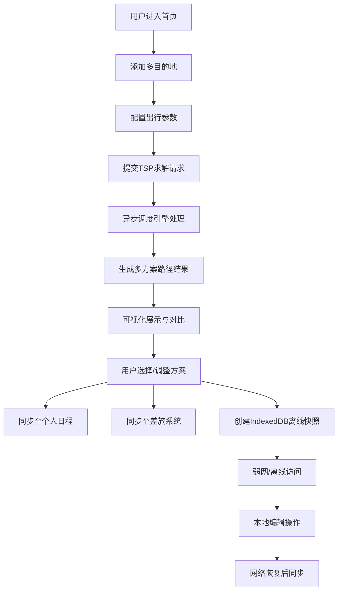
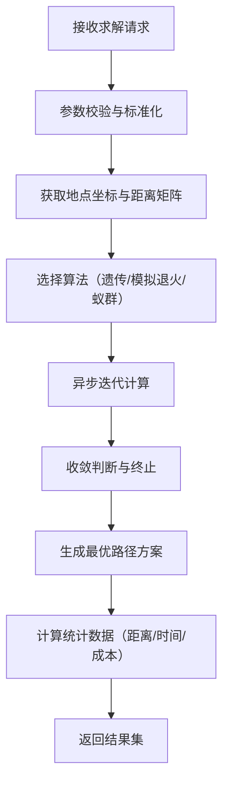

## 1. 产品概述

TripNexus 是一款基于 Next.js 的智能多目的地旅行路径规划系统，为差旅人士、自助游客和商务出行者提供最优路径求解、多系统日程同步与离线可用的旅行规划服务。通过 TSP（旅行商问题）算法优化多目的地行程顺序，结合地图服务、个人日程与差旅系统的数据映射，实现出行方案的智能调度与可靠流转。

**核心价值**：
- 解决多目的地出行的路径优化难题，降低时间与交通成本
- 打通个人日程、地图导航与差旅系统的数据孤岛，实现行程数据实时同步
- 提供离线行程快照能力，保障弱网环境下行程数据的可靠性与可用性

## 2. 核心功能

### 2.1 用户角色

| 角色 | 注册方式 | 核心权限 |
|------|---------|----------|
| 普通用户 | 邮箱/第三方登录 | 创建行程、路径规划、日程同步、离线存储 |
| 商务用户 | 企业邮箱注册 | 差旅系统集成、团队行程管理、报销对接 |

### 2.2 功能模块

1. **行程规划首页**：目的地输入、行程参数配置、TSP 求解入口
2. **路径优化面板**：可视化路径展示、多种优化算法对比、方案调整
3. **日程管理中心**：个人日程导入、差旅系统同步、日历视图
4. **地图服务集成**：实时路况展示、导航跳转、地点搜索
5. **离线管理中心**：行程快照列表、离线状态监控、数据同步管理
6. **方案调度引擎**：多变量参数配置、异步任务状态、方案对比选择

### 2.3 页面详情

| 页面名称 | 模块名称 | 功能描述 |
|---------|---------|----------|
| 首页 | 行程创建模块 | 目的地添加（支持批量导入）、日期时间设置、出行方式选择（飞机/高铁/自驾/步行）、约束条件配置（停留时间、营业时间、优先级） |
| 首页 | TSP 求解面板 | 算法选择（最近邻/遗传算法/模拟退火/蚁群算法）、求解进度显示、多方案对比展示 |
| 路径详情页 | 可视化地图 | 交互式地图展示最优路径、途经点标记、距离/时间统计、路径拖拽调整 |
| 路径详情页 | 日程时间轴 | 每日行程时间轴展示、地点详情卡片、停留时间编辑、提醒设置 |
| 日程同步页 | 日历集成 | Google Calendar/Outlook/国内日历服务导入、双向同步配置、冲突检测与提醒 |
| 日程同步页 | 差旅系统对接 | 差旅申请单同步、报销数据关联、审批状态追踪 |
| 离线中心页 | 快照管理 | 行程快照列表、手动/自动快照配置、快照版本对比、数据恢复 |
| 离线中心页 | 状态监控 | 网络状态检测、离线操作队列、数据冲突解决、同步进度 |
| 设置页 | 用户偏好 | 度量单位设置、默认出行方式、提醒偏好、主题设置 |
| 设置页 | 服务配置 | 地图服务密钥管理、日程服务授权、差旅系统接入配置 |

## 3. 核心流程

### 用户主流程
用户进入首页后，添加多个目的地并配置出行参数（日期、交通方式、约束条件），系统通过 TSP 求解引擎异步计算最优路径。计算完成后，用户可在地图上可视化查看路径方案，调整途经点顺序或停留时间。确认方案后，系统自动将行程同步到个人日历和差旅系统，并创建本地离线快照。用户可在离线状态下查看和编辑行程，网络恢复后自动同步所有变更。

### TSP 求解核心流程

## 4. 用户界面设计

### 4.1 设计风格

**设计理念**：科技感与人文关怀的平衡，采用现代极简主义与旅行探索主题相结合的风格，通过渐变色彩和微交互动效传达智能与便捷的产品调性。

- **主色调**：深海蓝 `#0A2463`（代表探索与可靠）
- **辅助色**：极光青 `#3E92CC`（代表智能与科技）、落日橙 `#FF6B35`（代表活力与行动）
- **中性色**：墨灰 `#1A1A2E`、银灰 `#F7F7FF`、纯白 `#FFFFFF`
- **按钮风格**：圆角 12px，渐变填充，悬浮时轻微上浮并带发光效果
- **字体**：
  - 标题：`Space Grotesk`（现代几何无衬线，传达科技感）
  - 正文：`Inter`（清晰易读，确保信息传达效率）
- **布局风格**：卡片式布局，大量留白，层次分明的阴影系统
- **图标风格**：线性图标 + 渐变填充，统一 2px 线宽，圆角端点
- **动效原则**：页面加载时元素依次渐入（staggered reveal），卡片悬浮时轻微缩放+阴影加深，地图路径绘制时使用描边动画

### 4.2 页面设计概览

| 页面名称 | 模块名称 | UI 元素 |
|---------|---------|----------|
| 首页 | 英雄区 | 全屏渐变背景，动态粒子效果，大标题采用渐变色，CTA 按钮带脉冲动画 |
| 首页 | 目的地输入 | 类搜索框设计，支持拖拽排序，每个目的地卡片带删除和编辑按钮 |
| 首页 | 参数配置面板 | 可折叠侧栏，滑块控件配置时间窗口，开关控件启用/禁用约束条件 |
| 路径详情页 | 地图区域 | 占 70% 屏宽的交互式地图，路径采用渐变描边动画，途经点脉冲标记 |
| 路径详情页 | 时间轴面板 | 30% 屏宽侧边栏，垂直时间轴设计，每个节点带时间、地点、图标，支持拖拽调整 |
| 日程同步页 | 日历视图 | 月/周/日切换，行程事件块采用渐变色，支持拖拽调整时间 |
| 离线中心页 | 快照卡片 | 时间线布局，卡片显示创建时间、地点数量、同步状态，悬停展示操作按钮 |
| 离线中心页 | 状态指示器 | 顶部常驻网络状态条，离线时显示橙色警告，同步时显示进度动画 |

### 4.3 响应式设计

- **设计策略**：Desktop-first，流畅适配移动端
- **断点设置**：
  - 桌面端：≥ 1280px（三栏布局：地图 + 时间轴 + 参数面板）
  - 平板端：768px - 1279px（两栏布局：地图 + 折叠侧边栏）
  - 移动端：< 768px（单栏布局，Tab 切换地图/时间轴/设置）
- **触摸优化**：移动端点击目标 ≥ 48x48px，按钮间距 ≥ 8px，支持滑动手势操作

### 4.4 可视化与动效

- **地图路径动画**：路径采用 SVG 描边动画（stroke-dashoffset），从起点到终点逐步绘制，耗时约 1.5s
- **TSP 求解加载动画**：节点连线动态重组动画，配合进度百分比显示
- **卡片入场动画**：使用 CSS `animation-delay` 实现依次渐入，每个卡片延迟 100ms
- **离线状态切换**：顶部状态栏平滑滑入，背景色从蓝色渐变到橙色（离线警告）
- **交互反馈**：所有可点击元素 `:hover` 状态带轻微缩放（transform: scale(1.02)）和阴影加深
