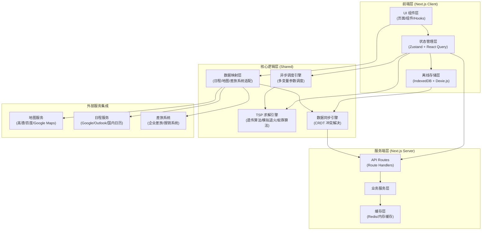

## 1. 架构设计

TripNexus 采用 Next.js App Router 全栈架构，前端使用 React 18 + TypeScript，后端利用 Next.js Route Handlers 提供 API 服务。核心逻辑层包括 TSP 求解引擎、异步调度引擎、数据同步引擎三大模块，通过 IndexedDB 实现本地离线存储，与外部地图服务、日程服务、差旅系统通过适配器模式进行集成。



## 2. 技术描述

### 2.1 技术栈选型

| 层级 | 技术选型 | 版本 | 用途说明 |
|------|---------|------|----------|
| 前端框架 | Next.js | 14.x | App Router，支持 SSR/SSG/ISR |
| UI 框架 | React | 18.x | 并发特性、Suspense、Transitions |
| 类型系统 | TypeScript | 5.x | 类型安全、代码智能提示 |
| 样式方案 | Tailwind CSS | 3.x | 原子化 CSS、响应式设计 |
| 状态管理 | Zustand | 4.x | 轻量级状态管理、跨组件共享 |
| 服务端状态 | TanStack Query | 5.x | 数据缓存、自动重试、乐观更新 |
| 动画库 | Framer Motion | 11.x | 流畅动效、路径动画、手势交互 |
| 地图组件 | @vis.gl/react-google-maps | 1.x | 或国内地图 SDK，交互式地图展示 |
| 离线存储 | Dexie.js | 4.x | IndexedDB 封装、类型安全、离线查询 |
| 图标库 | Lucide React | 0.400.x | 现代线性图标、按需加载 |
| 日期处理 | date-fns | 3.x | 轻量级日期处理、时区支持 |
| 表单处理 | React Hook Form | 7.x | 高性能表单、Schema 校验 |
| 校验库 | Zod | 3.x | TypeScript-first Schema 校验 |
| 工具函数 | Lodash-es | 4.x | 工具函数、集合操作 |

### 2.2 核心算法模块

- **TSP 求解引擎**：实现多种启发式算法
  - 最近邻算法（Nearest Neighbor）：快速求解，适合 10 个点以下
  - 遗传算法（Genetic Algorithm）：全局搜索，适合 10-50 个点
  - 模拟退火算法（Simulated Annealing）：跳出局部最优
  - 蚁群算法（Ant Colony Optimization）：群体智能，适合大规模求解
  - 支持多目标优化：最短距离、最短时间、最低成本

- **异步调度引擎**：
  - 基于 Web Worker 的后台计算
  - 任务优先级队列
  - 进度实时回调
  - 可取消的异步任务
  - 多方案并行计算与对比

- **数据同步引擎**：
  - 基于 CRDT（Conflict-free Replicated Data Types）的冲突解决
  - 操作日志队列
  - 增量同步
  - 网络状态监听与自动重连

## 3. 路由定义

| 路由路径 | 页面名称 | 用途 | 渲染模式 |
|---------|---------|------|---------|
| `/` | 首页 | 行程创建、目的地输入、TSP 求解入口 | Client Component |
| `/trip/[id]` | 路径详情页 | 可视化地图展示、时间轴、路径调整 | Dynamic Route, SSR |
| `/calendar` | 日程同步页 | 日历视图、日程导入、同步配置 | Client Component |
| `/offline` | 离线中心页 | 快照管理、状态监控、同步操作 | Client Component |
| `/settings` | 设置页 | 用户偏好、服务配置 | Client Component |
| `/api/tsp/solve` | TSP 求解 API | 提交 TSP 求解任务 | Route Handler |
| `/api/tsp/[taskId]` | 求解状态 API | 查询求解进度与结果 | Route Handler |
| `/api/trip` | 行程 CRUD API | 行程数据增删改查 | Route Handler |
| `/api/sync/calendar` | 日程同步 API | 日历服务数据同步 | Route Handler |
| `/api/sync/travel` | 差旅同步 API | 差旅系统数据同步 | Route Handler |

## 4. API 定义

### 4.1 TypeScript 类型定义

```typescript
// 地点类型
interface Location {
  id: string;
  name: string;
  address: string;
  coordinates: { lat: number; lng: number };
  duration: number; // 停留时间（分钟）
  priority: 1 | 2 | 3; // 优先级
  openHours?: { start: string; end: string };
  constraints?: LocationConstraint[];
}

// 约束条件
interface LocationConstraint {
  type: 'time_window' | 'must_visit' | 'avoid';
  startTime?: string;
  endTime?: string;
}

// TSP 求解请求
interface TSPSolveRequest {
  locations: Location[];
  startDate: string;
  endDate: string;
  transportMode: 'driving' | 'transit' | 'walking' | 'flying';
  algorithm: 'nearest_neighbor' | 'genetic' | 'simulated_annealing' | 'ant_colony';
  optimizationGoal: 'distance' | 'time' | 'cost' | 'balanced';
  constraints: {
    dailyHours: { start: string; end: string };
    maxDailyDistance: number;
    avoidTolls: boolean;
  };
}

// TSP 求解响应
interface TSPSolveResponse {
  taskId: string;
  status: 'pending' | 'processing' | 'completed' | 'failed';
  progress: number;
  result?: TSPResult;
  error?: string;
  createdAt: string;
}

// TSP 求解结果
interface TSPResult {
  optimalPath: Location[];
  totalDistance: number; // 公里
  totalDuration: number; // 分钟
  totalCost: number; // 预估费用
  segments: PathSegment[];
  dailyItineraries: DailyItinerary[];
  algorithmUsed: string;
  fitnessScore: number;
  alternativePaths: TSPResult[];
}

// 路径段
interface PathSegment {
  from: Location;
  to: Location;
  distance: number;
  duration: number;
  mode: string;
  polyline: string; // 地图路径编码
}

// 每日行程
interface DailyItinerary {
  date: string;
  locations: Location[];
  startTime: string;
  endTime: string;
  totalDistance: number;
  totalDuration: number;
}

// 行程快照
interface TripSnapshot {
  id: string;
  tripId: string;
  version: number;
  data: TSPResult;
  createdAt: string;
  synced: boolean;
  syncStatus: 'pending' | 'synced' | 'conflict';
  operations: OperationLog[];
}

// 操作日志
interface OperationLog {
  id: string;
  type: 'create' | 'update' | 'delete';
  entityType: 'trip' | 'location' | 'snapshot';
  payload: Record<string, unknown>;
  timestamp: string;
  offline: boolean;
}
```

### 4.2 API Schema

```typescript
// POST /api/tsp/solve
// Request: TSPSolveRequest
// Response: { taskId: string; status: 'pending' }

// GET /api/tsp/[taskId]
// Response: TSPSolveResponse

// POST /api/trip
// Request: { name: string; result: TSPResult; locations: Location[] }
// Response: { id: string; ...tripData }

// GET /api/trip
// Response: Trip[]

// GET /api/trip/[id]
// Response: Trip

// PUT /api/trip/[id]
// Request: Partial<Trip>
// Response: Trip

// DELETE /api/trip/[id]
// Response: { success: boolean }

// POST /api/sync/calendar
// Request: { tripId: string; calendarProvider: string }
// Response: { syncedEvents: number; conflicts: CalendarConflict[] }

// POST /api/sync/travel
// Request: { tripId: string; system: string }
// Response: { applicationId: string; status: string }
```

## 5. 数据模型

### 5.1 ER 图

```mermaid
erDiagram
    TRIP ||--o{ LOCATION : contains
    TRIP ||--o{ ITINERARY_DAY : has
    TRIP ||--o{ TRIP_SNAPSHOT : has
    ITINERARY_DAY ||--o{ LOCATION : includes
    LOCATION ||--o{ PATH_SEGMENT : from
    LOCATION ||--o{ PATH_SEGMENT : to
    TRIP ||--o{ OPERATION_LOG : generates
    TRIP_SNAPSHOT ||--o{ OPERATION_LOG : tracks
    CALENDAR_EVENT }o--|| LOCATION : maps_to
    TRAVEL_APPLICATION }o--|| TRIP : links_to

    TRIP {
        uuid id PK
        string name
        string userId
        string status
        datetime startDate
        datetime endDate
        string transportMode
        json tspResult
        datetime createdAt
        datetime updatedAt
    }

    LOCATION {
        uuid id PK
        uuid tripId FK
        string name
        string address
        decimal lat
        decimal lng
        int duration
        int priority
        json constraints
        int orderIndex
    }

    ITINERARY_DAY {
        uuid id PK
        uuid tripId FK
        date date
        time startTime
        time endTime
        decimal totalDistance
        int totalDuration
    }

    PATH_SEGMENT {
        uuid id PK
        uuid tripId FK
        uuid fromLocationId FK
        uuid toLocationId FK
        decimal distance
        int duration
        string transportMode
        text polyline
    }

    TRIP_SNAPSHOT {
        uuid id PK
        uuid tripId FK
        int version
        json data
        datetime createdAt
        boolean synced
        string syncStatus
    }

    OPERATION_LOG {
        uuid id PK
        uuid tripId FK
        uuid snapshotId FK
        string type
        string entityType
        json payload
        datetime timestamp
        boolean offline
    }

    CALENDAR_EVENT {
        uuid id PK
        uuid locationId FK
        string externalId
        string provider
        string title
        datetime startTime
        datetime endTime
        string status
    }

    TRAVEL_APPLICATION {
        uuid id PK
        uuid tripId FK
        string externalId
        string system
        string status
        decimal estimatedCost
        json approvalFlow
    }
```

### 5.2 IndexedDB Schema（Dexie.js）

```typescript
// 本地数据库表结构
interface TripNexusDB extends Dexie {
  trips: Table<Trip, string>;
  locations: Table<Location, string>;
  snapshots: Table<TripSnapshot, string>;
  operationLogs: Table<OperationLog, string>;
  settings: Table<UserSetting, string>;
  syncQueue: Table<SyncQueueItem, string>;
}

// 索引配置
// trips: '&id, userId, createdAt, updatedAt'
// locations: '&id, tripId, orderIndex'
// snapshots: '&id, tripId, version, createdAt'
// operationLogs: '&id, tripId, timestamp, offline'
// settings: '&key'
// syncQueue: '&id, type, status, createdAt'
```

## 6. 核心模块架构

### 6.1 TSP 求解引擎模块

```
src/lib/tsp/
├── index.ts                 # 引擎入口
├── types.ts                 # 类型定义
├── algorithms/
│   ├── nearest-neighbor.ts  # 最近邻算法
│   ├── genetic.ts           # 遗传算法
│   ├── simulated-annealing.ts # 模拟退火
│   └── ant-colony.ts        # 蚁群算法
├── distance-matrix.ts       # 距离矩阵计算
├── fitness.ts               # 适应度函数
├── optimizer.ts             # 优化器调度
└── worker.ts                # Web Worker 封装
```

### 6.2 异步调度引擎模块

```
src/lib/scheduler/
├── index.ts                 # 调度器入口
├── types.ts                 # 类型定义
├── task-queue.ts            # 任务优先级队列
├── worker-pool.ts           # Worker 池管理
├── progress-tracker.ts      # 进度追踪
└── multi-variable.ts        # 多变量参数扫描
```

### 6.3 离线存储与同步模块

```
src/lib/offline/
├── index.ts                 # 离线模块入口
├── db.ts                    # Dexie 数据库实例
├── crdt.ts                  # CRDT 冲突解决
├── sync-engine.ts           # 同步引擎
├── operation-queue.ts       # 操作队列
└── network-monitor.ts       # 网络状态监听
```

### 6.4 数据映射层

```
src/lib/mappers/
├── index.ts                 # 映射器入口
├── calendar-mapper.ts       # 日程系统适配
├── map-mapper.ts            # 地图服务适配
└── travel-mapper.ts         # 差旅系统适配
```
