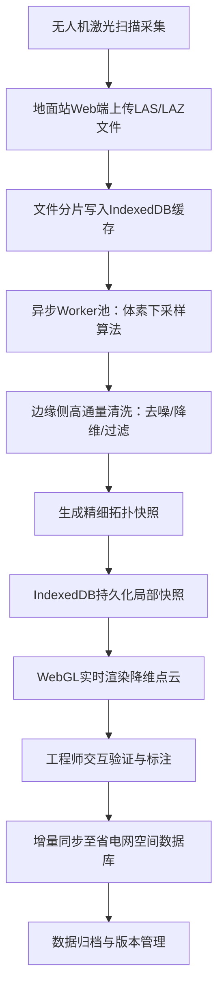

## 1. 产品概述

电力巡检无人机激光点云实时降维中枢系统，面向电网巡检运维场景，解决超大点云数据跨网络传输与实时可视化难题。通过空间体素下采样算法、边缘侧Worker高通量清洗与IndexedDB持久化缓存，实现无人机手持地面站与省电网空间数据库的高效业务联动。

- **核心目标**：将GB级激光点云数据在边缘侧实现100:1降维压缩，保障实时可视化流畅性与数据完整性
- **目标用户**：电网巡检工程师、运维技术人员、空间数据管理员
- **市场价值**：突破带宽限制，实现野外巡检数据的高效流转与秒级加载

## 2. 核心功能

### 2.1 用户角色
| 角色 | 注册方式 | 核心权限 |
|------|----------|----------|
| 巡检工程师 | 工号登录 | 点云上传、降维处理、实时预览、任务管理 |
| 数据管理员 | 管理员账号 | 数据库同步、缓存管理、数据归档、系统配置 |
| 运维工程师 | 工号登录 | 状态监控、日志查看、故障排查 |

### 2.2 功能模块
1. **主控台**：任务概览、实时处理进度、系统状态监控
2. **点云处理中心**：数据上传、体素下采样、Worker清洗队列、质量评估
3. **三维可视化**：WebGL点云渲染、多视角切换、测量工具、图层控制
4. **数据同步管理**：地面站缓存监控、数据库双向同步、传输链路状态
5. **拓扑快照管理**：IndexedDB缓存列表、精细快照查看、缓存策略配置

### 2.3 页面详情
| 页面名称 | 模块名称 | 功能描述 |
|----------|----------|----------|
| 主控台 | 任务看板 | 实时显示处理中任务队列、进度条、CPU/内存占用、Worker状态 |
| 主控台 | 数据统计 | 今日处理总量、降维比率、缓存命中率、同步延迟指标 |
| 点云处理中心 | 文件上传 | 支持LAS/LAZ/PCD格式拖拽上传，大文件分片上传 |
| 点云处理中心 | 下采样配置 | 体素网格尺寸调节、距离阈值、强度过滤参数配置 |
| 点云处理中心 | 处理队列 | Worker线程状态、任务优先级调度、错误重试机制 |
| 三维可视化 | 点云渲染器 | WebGL高性能渲染、LOD层级加载、颜色映射配置 |
| 三维可视化 | 交互工具 | 旋转/平移/缩放、距离测量、截面切割、点选查询 |
| 数据同步管理 | 链路监控 | 地面站→数据库传输速率、断点续传、队列管理 |
| 拓扑快照管理 | 缓存浏览器 | IndexedDB存储列表、快照详情、缓存清理策略 |

## 3. 核心流程

### 业务主流程
无人机采集激光点云数据 → 手持地面站通过Web应用上传 → 异步Worker线程进行体素下采样与高通量清洗 → IndexedDB持久化缓存局部精细拓扑快照 → WebGL实时渲染降维后点云 → 增量同步至省电网空间数据库 → 数据归档与备份

### 数据处理流水线

## 4. 用户界面设计

### 4.1 设计风格
- **主色调**：深空灰(#0a0e17)背景 + 电力蓝(#00d4ff)主题色 + 警示橙(#ff9500)状态色
- **视觉风格**：赛博工业风、科技感仪表盘、霓虹光效、网格化背景、数据可视化大屏
- **字体**：JetBrains Mono等宽字体显示数据指标，Inter作为界面字体
- **布局**：左右分栏导航 + 模块化卡片 + 可拖拽面板 + 全屏可视化区域
- **动效**：数据流转粒子动画、进度条渐变、卡片悬停发光、数据加载骨架屏

### 4.2 页面设计概览
| 页面名称 | 模块名称 | UI元素 |
|----------|----------|--------|
| 主控台 | 任务看板 | 玻璃拟态卡片、实时数据流、脉冲动画状态指示器、环形进度图 |
| 主控台 | 数据统计 | 大字号数值指标、趋势折线图、热力分布、同比环比箭头 |
| 点云处理中心 | 上传区域 | 拖拽虚线边框、文件图标动画、上传进度条、分片进度网格 |
| 点云处理中心 | 处理队列 | 表格行状态高亮、Worker线程徽标、优先级标签、错误重试按钮 |
| 三维可视化 | 渲染区域 | 全屏WebGL画布、悬浮工具条、视角切换罗盘、信息HUD浮层 |
| 数据同步管理 | 链路监控 | 实时速率波形图、节点拓扑连线、延迟仪表盘、重传队列 |
| 拓扑快照管理 | 缓存列表 | 卡片式布局、缩略图预览、存储占用进度条、过期标识 |

### 4.3 响应式设计
- **桌面端**：完整四栏布局，1920px以上最优体验，支持1280px~2560px自适应
- **平板端**：三栏布局，侧边栏可收起，可视化区域保持全屏
- **手持地面站**：优化触控交互，增大按钮尺寸，支持横屏/竖屏切换，离线模式缓存管理
- **触控优化**：最小44px触控目标，滑动手势支持3D视角操控，双击放大/缩小

### 4.4 3D场景设计
- **环境**：深空背景配合星点粒子、柔和环境光、蓝色轮廓光效
- **光照**：三点布光系统，主光45°照射，补光弱化阴影，轮廓光勾勒点云边缘
- **相机**：透视投影，初始俯视角45°，支持轨道控制器、飞行模式、第一人称漫游
- **点云样式**：按高程着色（蓝→绿→黄→红渐变）、按强度着色、按分类着色、纯色模式
- **后处理**：轻微泛光效果、FXAA抗锯齿、景深虚化、扫描线动画
- **性能预算**：单帧渲染100万点以内保持60fps，LOD策略动态调整点数量
