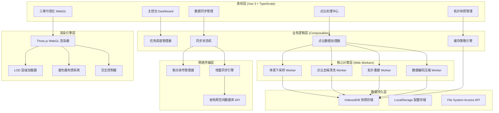
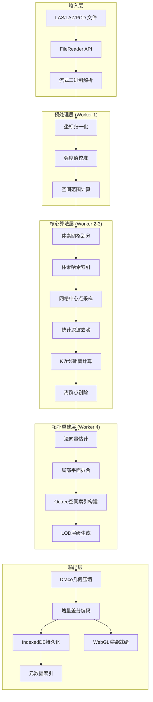
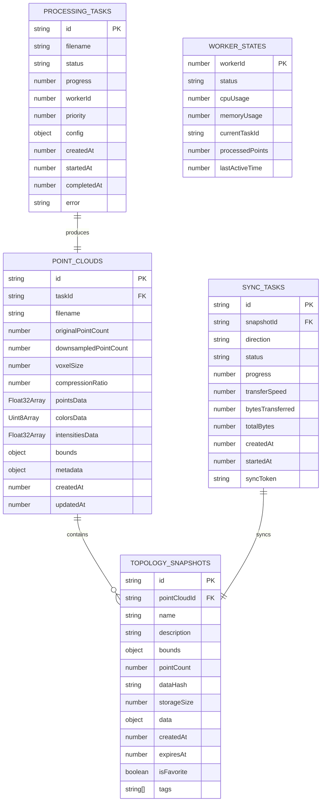

## 1. 架构设计



## 2. 技术描述

### 前端技术栈
- **核心框架**：Vue 3.4 + TypeScript 5.3 + Vite 5.0
- **路由管理**：Vue Router 4.x
- **状态管理**：Pinia 2.x
- **样式方案**：Tailwind CSS 3.4 + SCSS
- **3D渲染**：Three.js 0.160 + WebGL 2.0
- **图表可视化**：ECharts 5.4
- **图标库**：Lucide Icons
- **多线程**：Web Workers API + Comlink
- **本地存储**：IndexedDB + idb.js封装

### 核心算法模块
- **体素下采样算法**：基于空间网格的均匀下采样，支持自适应体素尺寸
- **统计滤波去噪**：基于K近邻的离群点去除算法
- **点云编码压缩**：Draco几何压缩 + 增量差分编码
- **空间索引**：Octree八叉树空间划分，加速邻域查询

### 性能优化策略
- **Web Worker池**：4线程并行处理，CPU亲和性调度
- **流式处理**：数据分片边传边处理，无需等待完整文件
- **LOD层级加载**：视距相关的点密度动态调整
- **内存池管理**：TypedArray复用，减少GC开销

## 3. 路由定义

| 路由路径 | 页面名称 | 功能说明 |
|----------|----------|----------|
| `/` | 主控台 | 任务概览、系统状态、实时数据统计 |
| `/processing` | 点云处理中心 | 文件上传、下采样配置、处理队列管理 |
| `/visualizer` | 三维可视化 | WebGL点云渲染、交互测量、图层控制 |
| `/sync` | 数据同步管理 | 链路监控、传输队列、断点续传 |
| `/snapshots` | 拓扑快照管理 | IndexedDB缓存浏览、快照详情、缓存策略 |
| `/settings` | 系统设置 | 参数配置、用户管理、日志查看 |

## 4. API 定义（模拟省电网空间数据库）

### TypeScript 类型定义

```typescript
// 点云数据结构
interface PointCloud {
  id: string;
  taskId: string;
  metadata: PointCloudMetadata;
  points: Float32Array;
  colors: Uint8Array;
  intensities: Float32Array;
  pointCount: number;
  bounds: BoundingBox;
  createdAt: number;
}

interface PointCloudMetadata {
  filename: string;
  originalSize: number;
  compressedSize: number;
  originalPointCount: number;
  downsampledPointCount: number;
  voxelSize: number;
  compressionRatio: number;
  acquisitionTime: number;
  droneId: string;
  location: GeoLocation;
}

interface BoundingBox {
  minX: number; minY: number; minZ: number;
  maxX: number; maxY: number; maxZ: number;
}

interface GeoLocation {
  latitude: number;
  longitude: number;
  altitude: number;
}

// 任务状态
interface ProcessingTask {
  id: string;
  filename: string;
  status: 'pending' | 'uploading' | 'processing' | 'completed' | 'failed';
  progress: number;
  workerId?: number;
  priority: number;
  config: DownsamplingConfig;
  createdAt: number;
  startedAt?: number;
  completedAt?: number;
  error?: string;
}

interface DownsamplingConfig {
  voxelSize: number;
  distanceThreshold: number;
  intensityFilter: { min: number; max: number };
  removeOutliers: boolean;
  outlierThreshold: number;
  compressionLevel: number;
}

// 拓扑快照
interface TopologySnapshot {
  id: string;
  pointCloudId: string;
  name: string;
  description: string;
  bounds: BoundingBox;
  pointCount: number;
  dataHash: string;
  storageSize: number;
  createdAt: number;
  expiresAt?: number;
  isFavorite: boolean;
  tags: string[];
}

// 同步任务
interface SyncTask {
  id: string;
  snapshotId: string;
  direction: 'upload' | 'download';
  status: 'pending' | 'transferring' | 'paused' | 'completed' | 'failed';
  progress: number;
  transferSpeed: number;
  bytesTransferred: number;
  totalBytes: number;
  createdAt: number;
  startedAt?: number;
}
```

### Mock API 接口

```typescript
// 获取任务列表
GET /api/tasks?status=&page=&pageSize=
Response: { data: ProcessingTask[], total: number }

// 创建处理任务
POST /api/tasks
Request: { filename: string, config: DownsamplingConfig }
Response: ProcessingTask

// 获取点云元数据
GET /api/pointclouds/:id/metadata
Response: PointCloudMetadata

// 增量同步
POST /api/sync/incremental
Request: { snapshotId: string, lastSyncTime: number }
Response: { changedChunks: ChunkInfo[], syncToken: string }

// 提交同步完成
POST /api/sync/confirm
Request: { syncToken: string }
Response: { success: boolean }

// 获取数据库点云列表
GET /api/database/pointclouds?region=&date=
Response: { data: PointCloudInfo[] }
```

## 5. 数据处理流水线架构



## 6. 数据模型

### 6.1 IndexedDB 数据模型



### 6.2 IndexedDB 初始化脚本

```typescript
// 数据库版本与Store定义
const DB_VERSION = 1;
const DB_NAME = 'UAVScan_PointCloudDB';

const STORES = {
  pointClouds: {
    keyPath: 'id',
    indexes: [
      { name: 'taskId', keyPath: 'taskId', unique: true },
      { name: 'filename', keyPath: 'filename', unique: false },
      { name: 'createdAt', keyPath: 'createdAt', unique: false }
    ]
  },
  topologySnapshots: {
    keyPath: 'id',
    indexes: [
      { name: 'pointCloudId', keyPath: 'pointCloudId', unique: false },
      { name: 'isFavorite', keyPath: 'isFavorite', unique: false },
      { name: 'createdAt', keyPath: 'createdAt', unique: false },
      { name: 'expiresAt', keyPath: 'expiresAt', unique: false }
    ]
  },
  processingTasks: {
    keyPath: 'id',
    indexes: [
      { name: 'status', keyPath: 'status', unique: false },
      { name: 'priority', keyPath: 'priority', unique: false },
      { name: 'createdAt', keyPath: 'createdAt', unique: false }
    ]
  },
  syncTasks: {
    keyPath: 'id',
    indexes: [
      { name: 'snapshotId', keyPath: 'snapshotId', unique: false },
      { name: 'status', keyPath: 'status', unique: false },
      { name: 'direction', keyPath: 'direction', unique: false }
    ]
  },
  workerStates: {
    keyPath: 'workerId',
    indexes: [
      { name: 'status', keyPath: 'status', unique: false },
      { name: 'currentTaskId', keyPath: 'currentTaskId', unique: false }
    ]
  }
};
```

## 7. 目录结构

```
src/
├── assets/                 # 静态资源
│   ├── styles/            # 全局样式
│   │   ├── main.scss
│   │   ├── variables.scss
│   │   └── animations.scss
│   └── shaders/           # WebGL着色器
│       ├── pointCloud.vert
│       └── pointCloud.frag
├── components/            # Vue组件
│   ├── dashboard/         # 主控台组件
│   ├── processing/        # 处理中心组件
│   ├── visualizer/        # 可视化组件
│   ├── sync/              # 同步管理组件
│   ├── snapshots/         # 快照管理组件
│   └── common/            # 通用组件
├── composables/           # Vue组合式函数
│   ├── useTaskManager.ts
│   ├── usePointCloudProcessor.ts
│   ├── useIndexedDB.ts
│   ├── useWebGLRenderer.ts
│   └── useSyncManager.ts
├── workers/               # Web Workers
│   ├── voxelDownsampler.worker.ts
│   ├── denoiser.worker.ts
│   ├── topologyBuilder.worker.ts
│   └── compressor.worker.ts
├── stores/                # Pinia状态管理
│   ├── taskStore.ts
│   ├── pointCloudStore.ts
│   ├── syncStore.ts
│   └── settingsStore.ts
├── utils/                 # 工具函数
│   ├── algorithm/         # 核心算法
│   │   ├── voxelGrid.ts
│   │   ├── statisticalFilter.ts
│   │   └── octree.ts
│   ├── pointcloud/        # 点云解析
│   │   ├── lasParser.ts
│   │   └── lazDecoder.ts
│   ├── storage/           # 存储封装
│   │   └── indexedDB.ts
│   └── worker/            # Worker管理
│       └── workerPool.ts
├── types/                 # TypeScript类型定义
│   ├── pointcloud.ts
│   ├── task.ts
│   ├── sync.ts
│   └── snapshot.ts
├── router/                # 路由配置
│   └── index.ts
├── views/                 # 页面视图
│   ├── Dashboard.vue
│   ├── ProcessingCenter.vue
│   ├── Visualizer.vue
│   ├── SyncManager.vue
│   ├── SnapshotManager.vue
│   └── Settings.vue
├── api/                   # API接口
│   ├── mock/              # Mock数据
│   ├── taskApi.ts
│   ├── syncApi.ts
│   └── databaseApi.ts
├── App.vue
└── main.ts
```
