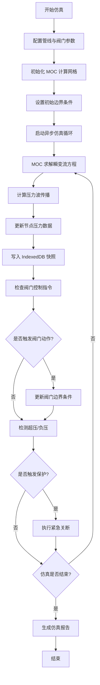

## 1. 产品概述

长输油气管线水锤效应仿真系统，基于异步特征线法(MOC)求解瞬变流控制方程，实现压力波传播数据在管网监控与阀门执行器间的逻辑协同，预防管道物理损伤，支持跨行政区域油气输送的安全性模拟。

- **主要目的**：模拟长输油气管线中的水锤效应，预测压力波传播，优化阀门控制策略
- **解决问题**：管道瞬变流导致的超压/负压、物理损伤、安全事故
- **目标用户**：油气输送工程师、管网运营人员、安全监管部门
- **产品价值**：降低管网运维风险、提升应急响应能力、辅助阀门调度决策

## 2. 核心功能

### 2.1 用户角色

| 角色 | 注册方式 | 核心权限 |
|------|----------|----------|
| 工程师 | 本地登录 | 配置管线参数、运行仿真、分析结果 |
| 操作员 | 本地登录 | 监控实时数据、操作阀门、查看历史记录 |
| 管理员 | 本地登录 | 系统配置、数据管理、用户管理 |

### 2.2 功能模块

1. **管网建模页**：管线节点配置、参数设置、区域划分
2. **仿真监控页**：实时压力可视化、压力波动画、阀门状态监控
3. **阀门控制页**：执行器操作、启闭时序配置、紧急关断
4. **数据分析页**：压力快照查询、历史对比、趋势分析
5. **系统设置页**：仿真参数配置、存储管理、数据导出

### 2.3 页面详情

| 页面名称 | 模块名称 | 功能描述 |
|-----------|-------------|---------------------|
| 管网建模页 | 管线编辑器 | 可视化拖拽创建管线网络，设置管径、壁厚、材质参数 |
| 管网建模页 | 节点配置 | 添加压力传感器、阀门、泵站等设备节点 |
| 管网建模页 | 区域管理 | 划分行政区域，配置区域边界与连接关系 |
| 仿真监控页 | 压力热力图 | 管线各节点实时压力的色彩映射可视化 |
| 仿真监控页 | 波形动画 | 压力波沿管线传播的动态动画演示 |
| 仿真监控页 | 数据面板 | 实时显示各节点压力、流速、流量数据 |
| 阀门控制页 | 执行器面板 | 单个/批量阀门启闭控制，开度调节 |
| 阀门控制页 | 时序配置 | 设置阀门启闭时间曲线，支持程序化控制 |
| 阀门控制页 | 紧急响应 | 一键紧急关断，超压自动保护触发 |
| 数据分析页 | 快照查询 | 从 IndexedDB 查询历史压力快照 |
| 数据分析页 | 对比分析 | 多工况下压力波形对比，损伤风险评估 |
| 系统设置页 | 仿真参数 | MOC 算法参数、时间步长、空间步长配置 |
| 系统设置页 | 数据管理 | IndexedDB 存储清理、数据导入导出 |

## 3. 核心流程

## 4. 用户界面设计

### 4.1 设计风格

- **主色调**：工业深蓝 (#0F172A) 作为背景，警示红 (#EF4444)、安全绿 (#22C55E)、预警橙 (#F59E0B) 作为状态指示
- **辅助色**：管线蓝 (#3B82F6)、压力波紫 (#8B5CF6)、数据青 (#06B6D4)
- **按钮风格**：3D 微立体按钮，圆角 6px，悬停有阴影过渡
- **字体**：JetBrains Mono（等宽数据字体）+ Noto Sans SC（中文界面字体）
- **布局风格**：深色工业仪表盘风格，卡片式模块布局，网格对齐
- **图标风格**：线性工业图标，使用 Lucide React 图标库

### 4.2 页面设计概述

| 页面名称 | 模块名称 | UI 元素 |
|-----------|-------------|-------------|
| 仿真监控页 | 主视图区 | Canvas 绘制的管线拓扑图，压力热力图叠加，压力波动画层 |
| 仿真监控页 | 侧边数据栏 | 节点数据卡片，实时数值滚动更新，异常高亮闪烁 |
| 仿真监控页 | 底部控制栏 | 仿真播放/暂停/步进控制，速度调节，时间轴滑块 |
| 阀门控制页 | 执行器网格 | 阀门卡片网格，显示开度、状态、响应时间 |
| 阀门控制页 | 时序编辑器 | 时间轴可视化编辑，拖拽调整启闭曲线 |
| 数据分析页 | 图表区 | ECharts 压力波形图，多曲线叠加对比 |
| 数据分析页 | 快照列表 | 时间序列快照卡片，支持筛选检索 |

### 4.3 响应式

- **桌面优先**：1920px 基准设计，多面板并列布局
- **平板适配**：侧边栏可折叠，数据面板堆叠
- **触控优化**：阀门控制按钮增大点击区域，滑动手势支持时间轴缩放

### 4.4 可视化设计

- **管线渲染**：使用 WebGL 加速的 Canvas 绘制，支持上百节点流畅动画
- **压力波效果**：粒子系统模拟压力波传播，渐变色彩映射压力值
- **状态指示**：节点状态使用呼吸灯效果，超压时红色脉冲警告
- **过渡动画**：阀门启闭状态切换使用平滑过渡，数据更新使用数字滚动效果
