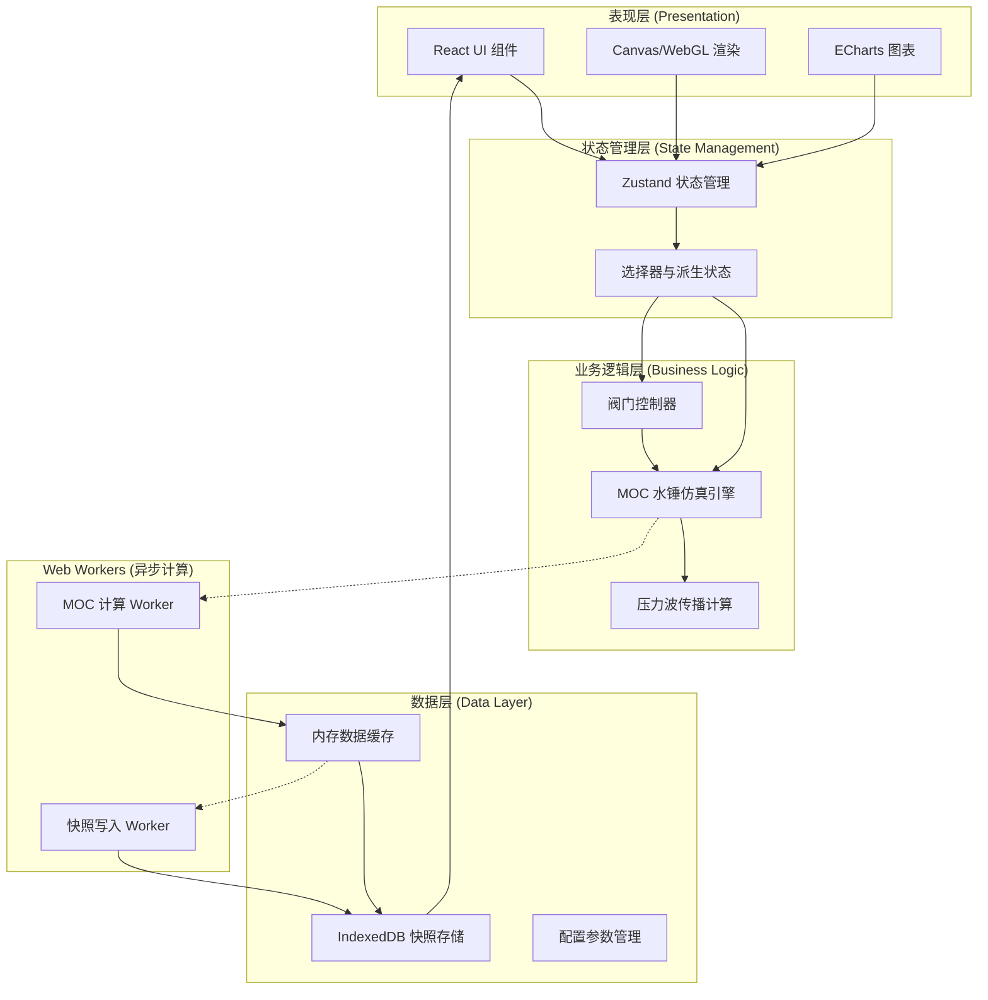
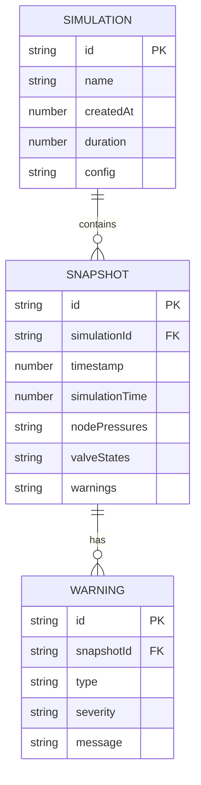

## 1. 架构设计



## 2. 技术描述

- **前端框架**: React@18 + TypeScript
- **构建工具**: Vite@5
- **样式方案**: TailwindCSS@3 + CSS Variables
- **状态管理**: Zustand@4 (轻量高性能状态管理)
- **可视化**: Canvas 2D + 原生 WebGL（管线渲染）、ECharts@5（数据图表）
- **异步计算**: Web Workers API (MOC 计算、数据持久化)
- **本地存储**: IndexedDB (idb 库封装)
- **图标库**: Lucide React
- **路由**: React Router@6
- **后端**: 无（纯前端仿真应用，数据全部本地存储）

## 3. 路由定义

| 路由 | 页面组件 | 用途 |
|-------|---------|---------|
| `/` | `DashboardPage` | 仿真监控仪表盘（默认首页） |
| `/network` | `NetworkBuilderPage` | 管网建模与配置 |
| `/valves` | `ValveControlPage` | 阀门执行器控制中心 |
| `/analysis` | `AnalysisPage` | 数据分析与历史快照 |
| `/settings` | `SettingsPage` | 系统参数配置 |

## 4. 核心数据结构

### 4.1 管线节点数据模型

```typescript
interface PipelineNode {
  id: string;
  type: 'junction' | 'valve' | 'pump' | 'reservoir' | 'sensor';
  name: string;
  x: number;
  y: number;
  region: string;
  elevation: number;
  pressure: number;
  flowRate: number;
  velocity: number;
}

interface PipelineSegment {
  id: string;
  fromNodeId: string;
  toNodeId: string;
  diameter: number;
  wallThickness: number;
  length: number;
  material: 'steel' | 'castIron' | 'plastic';
  roughness: number;
  waveSpeed: number;
}

interface Valve {
  id: string;
  nodeId: string;
  type: 'gate' | 'ball' | 'butterfly' | 'check';
  opening: number;
  targetOpening: number;
  maxFlowRate: number;
  responseTime: number;
  status: 'normal' | 'opening' | 'closing' | 'closed' | 'fault';
  autoProtection: boolean;
}

interface MOCPoint {
  x: number;
  Q: number;
  H: number;
  Cp: number;
  Cm: number;
}

interface PressureSnapshot {
  id: string;
  timestamp: number;
  simulationTime: number;
  nodePressures: Record<string, number>;
  segmentPressures: Record<string, number[]>;
  valveStates: Record<string, number>;
  warnings: Warning[];
}

interface Warning {
  id: string;
  type: 'overpressure' | 'underpressure' | 'cavitation' | 'valveFault';
  severity: 'low' | 'medium' | 'high' | 'critical';
  nodeId?: string;
  segmentId?: string;
  message: string;
  timestamp: number;
}
```

### 4.2 MOC 仿真配置

```typescript
interface MOCConfig {
  timeStep: number;
  totalTime: number;
  courantNumber: number;
  gravity: number;
  fluidDensity: number;
  fluidViscosity: number;
  pressureMin: number;
  pressureMax: number;
  snapInterval: number;
}
```

## 5. 核心算法模块

### 5.1 特征线法 (MOC) 求解器

**文件**: `src/engine/moc-solver.ts`

- 实现瞬变流基本方程：连续性方程 + 动量方程
- 沿特征线转换为常微分方程
- 计算 C+ 和 C- 特征线兼容性方程
- 处理内点、边界点（水库、阀门、泵）的求解
- 支持摩阻项计算（稳定摩阻 + 非稳定摩阻）

### 5.2 压力波传播计算

**文件**: `src/engine/wave-propagation.ts`

- 计算压力波速 a = sqrt(K/ρ / (1 + (K D)/(E e)))
- 追踪压力波前沿位置
- 计算反射系数与透射系数
- 波的叠加与干涉计算

### 5.3 阀门控制逻辑

**文件**: `src/engine/valve-controller.ts`

- 阀门流量特性曲线
- 启闭时序插值计算
- 紧急关断控制逻辑
- 超压自动保护触发

## 6. IndexedDB 数据模型



## 7. 组件架构

```
src/
├── components/
│   ├── layout/
│   │   ├── AppShell.tsx
│   │   ├── Sidebar.tsx
│   │   └── Topbar.tsx
│   ├── pipeline/
│   │   ├── PipelineCanvas.tsx
│   │   ├── PipelineNode.tsx
│   │   ├── PressureHeatmap.tsx
│   │   └── WaveAnimation.tsx
│   ├── valves/
│   │   ├── ValveCard.tsx
│   │   ├── ValveGrid.tsx
│   │   ├── ValveTimeline.tsx
│   │   └── EmergencyPanel.tsx
│   ├── monitoring/
│   │   ├── DataPanel.tsx
│   │   ├── NodeMetricCard.tsx
│   │   └── WarningBanner.tsx
│   ├── analysis/
│   │   ├── PressureChart.tsx
│   │   ├── SnapshotList.tsx
│   │   └── ComparisonPanel.tsx
│   └── common/
│       ├── PlaybackControls.tsx
│       ├── NumberScroll.tsx
│       └── StatusIndicator.tsx
├── engine/
│   ├── moc-solver.ts
│   ├── wave-propagation.ts
│   ├── valve-controller.ts
│   └── moc-worker.ts
├── store/
│   ├── useSimulationStore.ts
│   ├── usePipelineStore.ts
│   └── useValveStore.ts
├── db/
│   ├── indexed-db.ts
│   └── snapshot-repository.ts
├── pages/
│   ├── DashboardPage.tsx
│   ├── NetworkBuilderPage.tsx
│   ├── ValveControlPage.tsx
│   ├── AnalysisPage.tsx
│   └── SettingsPage.tsx
└── types/
    └── index.ts
```

## 8. 性能优化策略

1. **Web Worker 分离计算**: MOC 核心计算在 Worker 线程执行，避免阻塞 UI
2. **增量渲染**: Canvas 管线图使用脏矩形检测，只重绘变化区域
3. **数据节流**: 仿真数据输出节流，UI 更新频率 30fps，计算频率 1000+ fps
4. **内存池**: 复用计算对象，减少 GC 压力
5. **IndexedDB 批量写入**: 快照数据批量写入，使用事务优化
