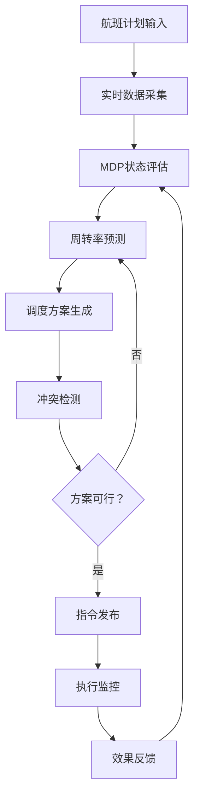
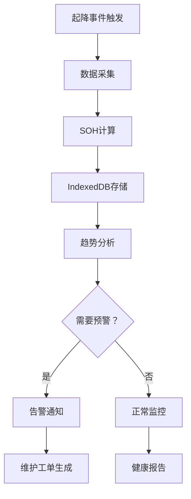
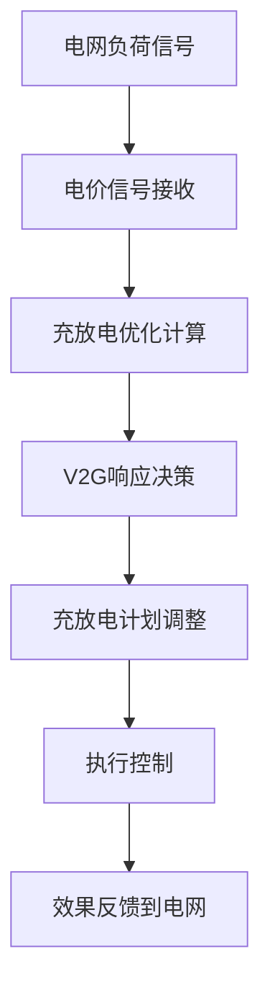

# VertiPulset - eVTOL城市空中交通枢纽智能管理系统 产品需求文档

## 1. 产品概述

VertiPulset是一个基于Next.js的城市电动垂直起降飞行器（eVTOL）枢纽智能管理系统，实现跑道起降效率优化、充放电曲线与空域调度在电网、航司间的协同控制。通过异步马尔可夫决策过程（MDP）预测场位周转率，配合IndexedDB存储万次起降事件的电池健康快照（SOH），为城市低空客运提供高可用的运行中枢。

- **核心价值**：解决城市低空交通的枢纽调度瓶颈，最大化跑道利用率，优化电池全生命周期管理，实现电网负荷平衡
- **目标用户**：城市交通管理部门、eVTOL运营商、电网调度中心、机场运行控制中心

## 2. 核心功能

### 2.1 用户角色

| 角色 | 注册方式 | 核心权限 |
|------|----------|----------|
| 系统管理员 | 企业域账号 | 全系统配置管理、用户权限分配 |
| 运行指挥员 | 工号认证 | 实时调度、起降指令发布、异常处理 |
| 数据分析员 | 工号认证 | 数据报表查看、趋势分析、预测模型调参 |
| 电网协同员 | 电网系统对接 | 充放电计划协调、负荷响应控制 |
| 航司调度员 | 航司系统对接 | 航班计划提交、机队状态监控 |

### 2.2 功能模块

1. **枢纽总览仪表板**：实时监控枢纽运行状态、跑道使用率、航班动态、电网负荷
2. **MDP智能调度引擎**：基于异步马尔可夫决策过程的场位周转率预测与优化
3. **电池健康管理系统**：IndexedDB存储万次起降SOH快照，电池全生命周期追踪
4. **充放电协同控制**：充放电曲线优化、V2G电网互动、负荷削峰填谷
5. **空域调度管理**：4D航迹规划、冲突检测与解脱、多航司协同
6. **运行效率分析**：KPI指标体系、历史趋势分析、预测性报告

### 2.3 页面详情

| 页面名称 | 模块名称 | 功能描述 |
|----------|----------|----------|
| 枢纽总览 | 实时状态面板 | 跑道状态、航班队列、天气信息、告警指示的综合展示 |
| 枢纽总览 | 效率仪表盘 | 关键KPI数字展示（周转率、准点率、能源效率等） |
| 调度控制 | MDP预测引擎 | 场位周转率预测、调度方案推荐、决策支持 |
| 调度控制 | 跑道分配矩阵 | 可视化跑道时隙分配、拖拽调整、冲突检测 |
| 电池管理 | SOH快照库 | 万次起降事件的电池健康数据查询、趋势分析 |
| 电池管理 | 健康预测模型 | 基于历史数据的SOH衰减预测、更换预警 |
| 能源协同 | 充放电曲线 | 实时充放电功率监控、历史曲线对比、未来预测 |
| 能源协同 | 电网互动面板 | V2G响应、负荷调整指令、电价信号展示 |
| 空域管理 | 4D航迹展示 | 三维空间+时间的航班航迹可视化 |
| 空域管理 | 冲突检测系统 | 实时冲突预警、自动解脱方案生成 |
| 分析报告 | 效率分析报表 | 多维度运行效率统计、对比分析 |
| 分析报告 | 预测性分析 | 基于AI的未来流量预测、资源需求规划 |

## 3. 核心流程

### 3.1 智能调度主流程

### 3.2 电池健康管理流程

### 3.3 电网协同流程

## 4. 用户界面设计

### 4.1 设计风格

- **设计理念**：科技感、未来感、专业可靠的工业控制系统风格
- **主色调**：深空蓝 (#0A1628) 作为背景，电光蓝 (#00D4FF) 作为主强调色，警示橙 (#FF6B35) 用于告警，生机绿 (#00FF94) 用于正常状态指示
- **辅助色**：科技紫 (#7C3AED)、金属灰 (#64748B)
- **按钮风格**：微玻璃拟态效果，圆角8px，微妙的内阴影和外发光
- **字体**：Space Grotesk（标题/数字）、Noto Sans SC（正文）
- **布局风格**：模块化卡片布局，网格化信息展示，支持自定义仪表盘配置
- **视觉效果**：数据可视化优先，大量使用实时图表、热力图、3D可视化
- **动效**：流畅的过渡动画、数据流可视化、脉冲效果提示关键信息

### 4.2 页面设计概览

| 页面名称 | 模块名称 | UI元素 |
|----------|----------|--------|
| 枢纽总览 | 实时状态面板 | 深色背景、发光边框卡片、实时数据刷新动画、状态指示灯 |
| 枢纽总览 | 效率仪表盘 | 大字号数字展示、动态进度环、趋势迷你图、配色编码状态 |
| 调度控制 | MDP预测引擎 | 概率分布曲线图、置信区间展示、方案对比卡片、决策树可视化 |
| 调度控制 | 跑道分配矩阵 | 甘特图风格时间轴、拖拽交互、冲突高亮、自动对齐辅助线 |
| 电池管理 | SOH快照库 | 数据表格、筛选器、SOH趋势折线图、电池热力图 |
| 电池管理 | 健康预测模型 | 衰减曲线预测、置信带、更换时间轴、风险等级矩阵 |
| 能源协同 | 充放电曲线 | 多Y轴图表、面积图叠加、阈值线、实时数据点标注 |
| 能源协同 | 电网互动面板 | 电价热力图、负荷预测曲线、V2G响应按钮组、反馈进度条 |
| 空域管理 | 4D航迹展示 | 三维地图、时间滑块、航迹动画、冲突区域高亮 |
| 空域管理 | 冲突检测系统 | 告警列表、倒计时显示、解脱方案对比、一键执行按钮 |
| 分析报告 | 效率分析报表 | 可配置图表、多维度筛选、导出按钮、数据透视表 |
| 分析报告 | 预测性分析 | 预测模型选择、参数调节器、结果对比视图、报告生成器 |

### 4.3 响应式设计

- **桌面优先**：默认针对2560x1440及以上分辨率优化，信息密度高
- **平板适配**：支持1024x768分辨率，模块可折叠，触控优化
- **移动适配**：关键指标监控、告警推送、紧急决策功能
- **大屏支持**：指挥中心大屏模式，优化远距离可读性

### 4.4 数据可视化规范

- **图表库**：统一使用Recharts进行2D图表展示
- **3D可视化**：使用@react-three/fiber实现空域和跑道的三维展示
- **实时更新**：高频数据采用WebSocket推送，低频次数据轮询更新
- **交互规范**：所有图表支持hover查看详情、点击钻取、缩放平移

