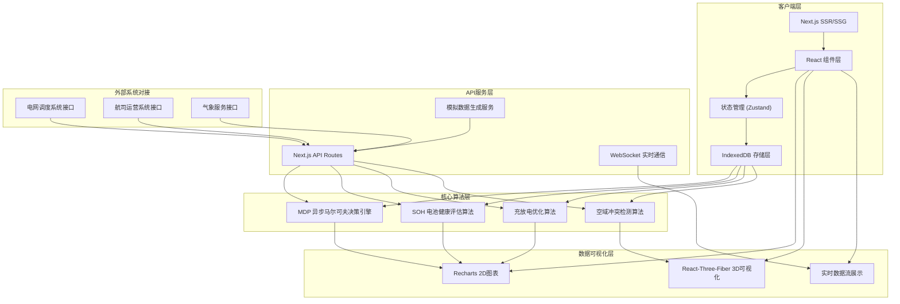
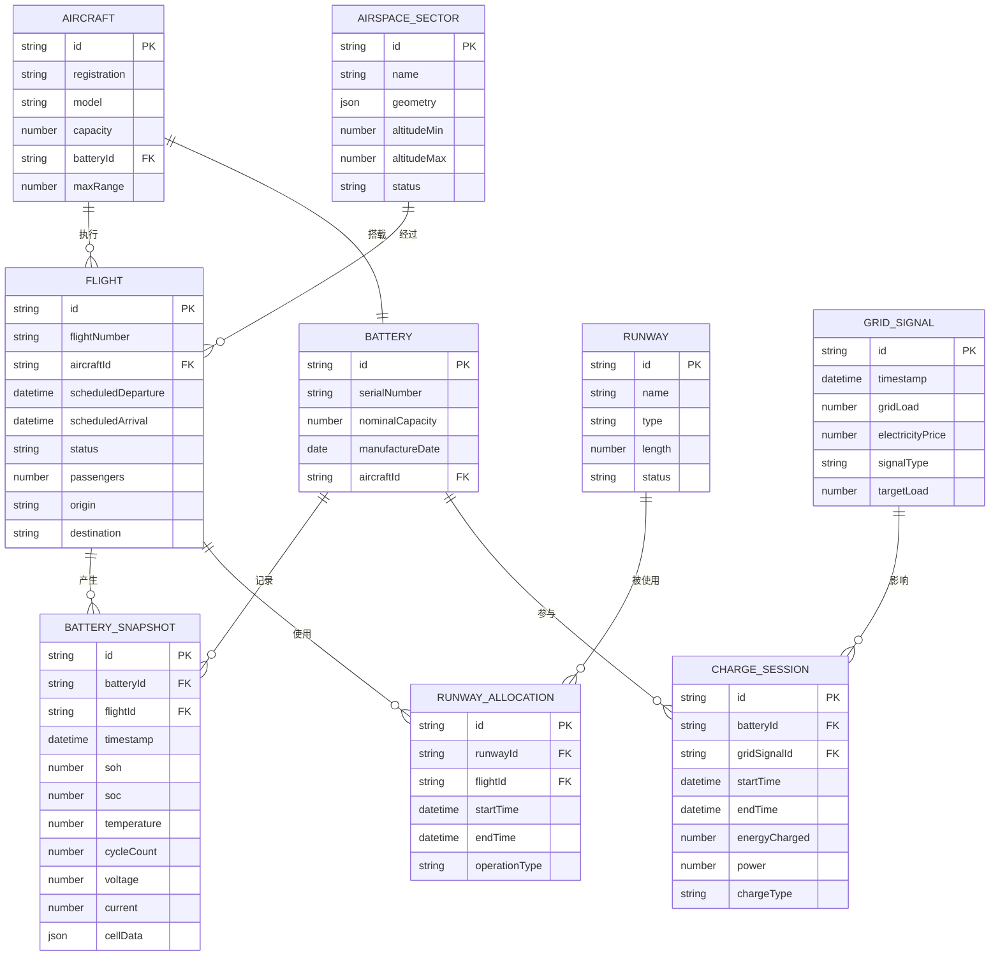

# VertiPulset - 技术架构文档

## 1. 架构设计



## 2. 技术描述

### 2.1 核心技术栈

| 类别 | 技术选型 | 版本 | 用途说明 |
|------|----------|------|----------|
| 前端框架 | Next.js | 14.x | React全栈框架，支持SSR/SSG |
| UI框架 | React | 18.x | 组件化开发 |
| 样式方案 | Tailwind CSS | 3.x | 原子化CSS，快速构建UI |
| 状态管理 | Zustand | 4.x | 轻量级状态管理，替代Redux |
| 图表库 | Recharts | 2.x | 2D数据可视化 |
| 3D引擎 | @react-three/fiber | 8.x | Three.js React绑定 |
| 3D组件 | @react-three/drei | 9.x | 常用3D组件库 |
| 本地数据库 | IndexedDB (idb) | 7.x | 浏览器端大规模数据存储 |
| 动画库 | Framer Motion | 11.x | 流畅的UI动画 |
| 日期处理 | date-fns | 3.x | 日期时间处理 |
| 图标库 | Lucide React | 0.x | 现代化图标集 |
| 类型系统 | TypeScript | 5.x | 类型安全 |

### 2.2 初始化方式

```bash
npx create-next-app@latest vertipulset --typescript --tailwind --eslint --src-dir --app --no-turbopack
```

### 2.3 项目结构

```
src/
├── app/                    # Next.js App Router
│   ├── layout.tsx         # 根布局
│   ├── page.tsx           # 枢纽总览
│   ├── dashboard/         # 仪表板模块
│   ├── scheduling/        # 调度控制模块
│   ├── battery/           # 电池管理模块
│   ├── energy/            # 能源协同模块
│   ├── airspace/          # 空域管理模块
│   └── reports/           # 分析报告模块
├── components/            # 通用组件
│   ├── ui/               # 基础UI组件
│   ├── charts/           # 图表组件
│   ├── three/            # 3D可视化组件
│   └── layout/           # 布局组件
├── lib/                   # 核心算法库
│   ├── mdp/              # MDP马尔可夫决策过程
│   ├── battery/          # 电池健康算法
│   ├── energy/           # 能源优化算法
│   └── airspace/         # 空域调度算法
├── store/                 # 状态管理
│   ├── useDashboardStore.ts
│   ├── useSchedulingStore.ts
│   ├── useBatteryStore.ts
│   └── useEnergyStore.ts
├── db/                    # IndexedDB数据库
│   ├── index.ts           # 数据库初始化
│   ├── schema.ts          # 数据模型定义
│   └── operations.ts      # 数据库操作
├── types/                 # TypeScript类型定义
│   ├── index.ts
│   ├── flight.ts
│   ├── battery.ts
│   ├── energy.ts
│   └── airspace.ts
├── utils/                 # 工具函数
│   ├── mock/             # 模拟数据生成
│   ├── format.ts         # 格式化工具
│   └── math.ts           # 数学计算工具
└── api/                   # API路由
    ├── flights/
    ├── battery/
    ├── energy/
    └── airspace/
```

## 3. 路由定义

| 路由 | 页面名称 | 用途说明 |
|------|----------|----------|
| / | 枢纽总览 | 实时状态监控、效率仪表板 |
| /dashboard | 综合仪表板 | 多维度数据展示、自定义面板 |
| /scheduling | 调度控制 | MDP预测引擎、跑道分配矩阵 |
| /scheduling/mdp | MDP引擎 | 场位周转率预测、决策支持 |
| /battery | 电池管理 | SOH快照库、健康预测 |
| /battery/snapshots | SOH快照 | 万次起降数据查询分析 |
| /energy | 能源协同 | 充放电曲线、电网互动 |
| /energy/grid | 电网协同 | V2G响应、负荷管理 |
| /airspace | 空域管理 | 4D航迹展示、冲突检测 |
| /airspace/traffic | 交通流量 | 空域流量监控与预测 |
| /reports | 分析报告 | 效率分析、预测性报告 |
| /reports/efficiency | 效率分析 | KPI统计、趋势分析 |

## 4. 数据模型

### 4.1 核心数据模型ER图



### 4.2 IndexedDB 数据存储设计

#### 数据库名称: `vertipulset_db`

| Object Store | 主键 | 索引 | 预估数据量 | 用途 |
|-------------|------|------|-----------|------|
| battery_snapshots | id | batteryId, timestamp, flightId, soh | 1,000,000+ | 电池健康快照 |
| flights | id | aircraftId, status, scheduledDeparture | 100,000+ | 航班记录 |
| runway_allocations | id | runwayId, startTime, flightId | 500,000+ | 跑道分配记录 |
| charge_sessions | id | batteryId, startTime, gridSignalId | 200,000+ | 充电会话记录 |
| grid_signals | id | timestamp, signalType | 500,000+ | 电网信号记录 |
| system_logs | id | timestamp, level, module | 1,000,000+ | 系统日志 |

## 5. 核心算法模块

### 5.1 MDP异步马尔可夫决策过程

**文件位置**: `src/lib/mdp/`

| 文件 | 功能描述 |
|------|----------|
| `types.ts` | MDP状态、动作、奖励类型定义 |
| `state.ts` | 状态空间定义与状态转换 |
| `action.ts` | 动作空间定义 |
| `reward.ts` | 奖励函数计算 |
| `solver.ts` | 异步值迭代求解器 |
| `predictor.ts` | 周转率预测器 |
| `optimizer.ts` | 调度方案优化器 |

**核心算法**:
- 异步值迭代算法 (Asynchronous Value Iteration)
- 蒙特卡洛树搜索 (Monte Carlo Tree Search)
- Q-Learning 强化学习优化

### 5.2 电池健康评估算法

**文件位置**: `src/lib/battery/`

| 文件 | 功能描述 |
|------|----------|
| `sohCalculator.ts` | SOH计算引擎 |
| `degradationModel.ts` | 电池衰减模型 |
| `lifePredictor.ts` | 剩余寿命预测 |
| `anomalyDetector.ts` | 异常检测算法 |

### 5.3 充放电优化算法

**文件位置**: `src/lib/energy/`

| 文件 | 功能描述 |
|------|----------|
| `chargeOptimizer.ts` | 充电计划优化 |
| `v2gController.ts` | V2G响应控制器 |
| `loadForecaster.ts` | 负荷预测器 |
| `curveGenerator.ts` | 充放电曲线生成 |

### 5.4 空域调度算法

**文件位置**: `src/lib/airspace/`

| 文件 | 功能描述 |
|------|----------|
| `trajectoryPlanner.ts` | 4D航迹规划器 |
| `conflictDetector.ts` | 冲突检测算法 |
| `resolutionGenerator.ts` | 解脱方案生成 |
| `flowManager.ts` | 流量管理器 |

## 6. 状态管理设计

### 6.1 Store 划分

| Store | 管理范围 | 关键状态 |
|-------|----------|----------|
| useDashboardStore | 枢纽总览 | 实时指标、告警状态、天气信息 |
| useSchedulingStore | 调度控制 | 航班队列、跑道分配、MDP预测结果 |
| useBatteryStore | 电池管理 | SOH快照、电池列表、健康预测 |
| useEnergyStore | 能源协同 | 充放电曲线、电网信号、V2G状态 |
| useAirspaceStore | 空域管理 | 航迹数据、冲突信息、流量数据 |

## 7. 性能优化策略

### 7.1 大数据量处理
- IndexedDB 分页查询 + 虚拟滚动
- Web Worker 后台计算 MDP 算法
- 数据压缩存储 (LZ-string)
- 时间序列数据降采样

### 7.2 渲染优化
- React.memo 避免不必要重渲染
- 按需加载 Three.js 场景
- 图表数据懒加载
- 列表虚拟化 (react-window)

### 7.3 存储优化
- IndexedDB 索引优化
- 历史数据归档策略
- 内存缓存 LRU 策略

## 8. 安全设计

- 前端数据加密存储
- API 接口鉴权
- 敏感操作二次确认
- 操作审计日志

