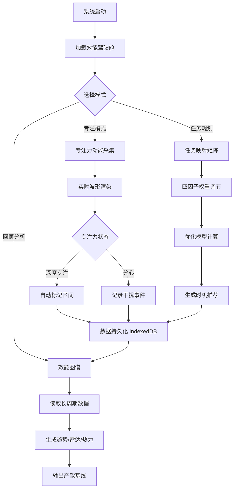

## 1. 产品概述

FocusFlow 是一款基于 SolidJS 构建的个体注意力执行优化与效能映射系统，通过异步多因子时间片分配优化模型动态调整任务执行策略，利用专注力动能反馈机制实时呈现个体专注状态，并借助 IndexedDB 构建长周期效能图谱，为跨系统协作提供量化的个体产能底座。
- 面向知识工作者与自管理型个体，解决注意力碎片化、任务优先级错位、效能数据孤岛三大痛点
- 核心价值：将个体注意力从"黑箱"转化为可量化、可优化、可映射的数据资产

## 2. 核心功能

### 2.1 用户角色
| 角色 | 注册方式 | 核心权限 |
|------|----------|----------|
| 个体用户 | 本地初始化 | 全部功能访问与数据管理 |
| 协作观察者 | 邀请链接 | 只读查看效能图谱与产能指标 |

### 2.2 功能模块
1. **效能驾驶舱**：实时专注力指标、今日时间片分配、任务执行队列、产能曲线概览
2. **专注力动能**：专注力波形实时渲染、动能反馈动画、专注区间自动标记、干扰事件记录
3. **任务映射矩阵**：任务优先级矩阵、跨系统任务同步映射、执行时机推荐、优先级权重调整
4. **效能图谱**：长周期效能趋势图、多维度效能雷达图、效能热力日历、产能基线报告

### 2.3 页面详情
| 页面名称 | 模块名称 | 功能描述 |
|----------|----------|----------|
| 效能驾驶舱 | 专注力仪表 | 实时显示当前专注力指数（0-100），配合动态弧形仪表盘动画 |
| 效能驾驶舱 | 时间片分配器 | 可视化展示今日各任务的时间片分配，支持拖拽调整 |
| 效能驾驶舱 | 执行队列 | 基于优化模型排序的任务队列，显示推荐执行时段与预估专注需求 |
| 效能驾驶舱 | 产能曲线 | 24小时产能趋势折线图，叠加历史同期对比 |
| 专注力动能 | 动能波形 | Canvas 实时渲染专注力波形，采样率1Hz，平滑插值 |
| 专注力动能 | 反馈光环 | 专注力越强光环越亮越密，分心时光环暗淡扩散 |
| 专注力动能 | 专注区间 | 自动标记深度专注区间（连续>25min），统计累计时长 |
| 专注力动能 | 干扰日志 | 记录分心事件类型与时间点，支持手动标注 |
| 任务映射矩阵 | 优先级矩阵 | 四象限矩阵展示紧急/重要分布，气泡大小=预估耗时 |
| 任务映射矩阵 | 系统映射 | 左侧工作软件任务列表 ↔ 右侧个人效能系统任务映射 |
| 任务映射矩阵 | 时机推荐 | 基于专注力预测曲线，推荐每个任务的最佳执行时段 |
| 任务映射矩阵 | 权重调节 | 滑块调节紧急度、重要度、专注需求、截止时间四因子权重 |
| 效能图谱 | 趋势曲线 | 7/30/90天效能趋势，支持多指标叠加对比 |
| 效能图谱 | 雷达图 | 专注深度、任务完成率、时间利用率、节奏稳定性、恢复效率五维 |
| 效能图谱 | 热力日历 | 日历视图，每日色深=当日综合效能分 |
| 效能图谱 | 基线报告 | 自动生成周/月产能基线报告，含改善建议 |

## 3. 核心流程

用户启动系统后，效能驾驶舱加载今日时间片分配方案与任务执行队列。用户进入专注模式，专注力动能模块实时采集专注数据并渲染波形，当检测到深度专注区间时自动记录。任务映射矩阵根据专注力预测曲线与多因子权重动态调整执行时机推荐。所有专注与任务数据持久化至 IndexedDB，效能图谱模块从长周期数据中生成趋势、雷达与热力图，为跨系统协作输出量化的产能基线。

## 4. 用户界面设计

### 4.1 设计风格
- **主色调**：深邃暗蓝 (#0a0e27) + 电光青 (#00f0ff) 强调色 + 琥珀橙 (#ff8c00) 警示色
- **辅助色**：极光绿 (#39ff14) 专注力高位、柔粉紫 (#c77dff) 低专注、碳灰 (#1a1d2e) 卡片
- **按钮风格**：圆角微3D（subtle glassmorphism），hover 时电光青边缘发光
- **字体**：标题使用 Orbitron（科技感显示字体），正文使用 Source Han Sans / Noto Sans SC
- **布局风格**：左侧固定导航栏 + 主内容区，卡片式模块网格，支持拖拽排列
- **图标风格**：线性描边图标（Lucide 风格），强调色填充

### 4.2 页面设计概览
| 页面名称 | 模块名称 | UI 元素 |
|----------|----------|---------|
| 效能驾驶舱 | 专注力仪表 | 弧形仪表盘、数字居中、光晕脉冲动画、青色渐变 |
| 效能驾驶舱 | 时间片分配器 | 水平堆叠条形图、彩色时间块、拖拽手柄、hover 放大 |
| 效能驾驶舱 | 执行队列 | 列表卡片、排序序号、优先级色带、推荐时段标签 |
| 效能驾驶舱 | 产能曲线 | SVG 折线图、渐变填充、历史线虚线叠加、hover tooltip |
| 专注力动能 | 动能波形 | Canvas 全宽波形、平滑贝塞尔、青色发光描边、暗底 |
| 专注力动能 | 反馈光环 | 圆形径向渐变光环、粒子扩散效果、专注时收缩明亮 |
| 专注力动能 | 专注区间 | 时间轴标注条、绿色色块标记、时长标签、累计统计 |
| 专注力动能 | 干扰日志 | 时间线列表、红点标记、类型图标、可展开详情 |
| 任务映射矩阵 | 优先级矩阵 | 四象限网格、气泡图、大小=耗时、颜色=紧急度、可拖拽 |
| 任务映射矩阵 | 系统映射 | 双栏连线图、左侧工作系统标签、右则效能系统标签、动画连线 |
| 任务映射矩阵 | 时机推荐 | 时间轴甘特条、推荐区段高亮、专注力曲线叠加 |
| 任务映射矩阵 | 权重调节 | 四个滑块、实时数值显示、调节后矩阵即时重排 |
| 效能图谱 | 趋势曲线 | 多色折线、7/30/90切换标签、渐变填充、交叉点标记 |
| 效能图谱 | 雷达图 | 五边形雷达、半透明填充、当前值+历史值叠加 |
| 效能图谱 | 热力日历 | 日历网格、色阶图例、hover 显示详情卡片 |
| 效能图谱 | 基线报告 | 报告卡片、指标摘要、改善建议列表、导出按钮 |

### 4.3 响应式
- 桌面优先设计（1440px 基准），平板（768px）自动折叠侧边栏为底部导航，手机（375px）单列堆叠布局
- 触控优化：时间片拖拽在移动端改为长按+滑动，滑块控件增大触摸区域

### 4.4 3D 场景指引
- 不涉及3D场景
