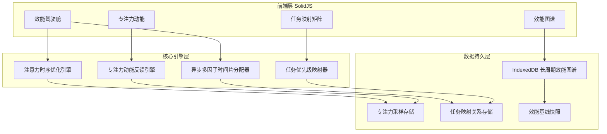
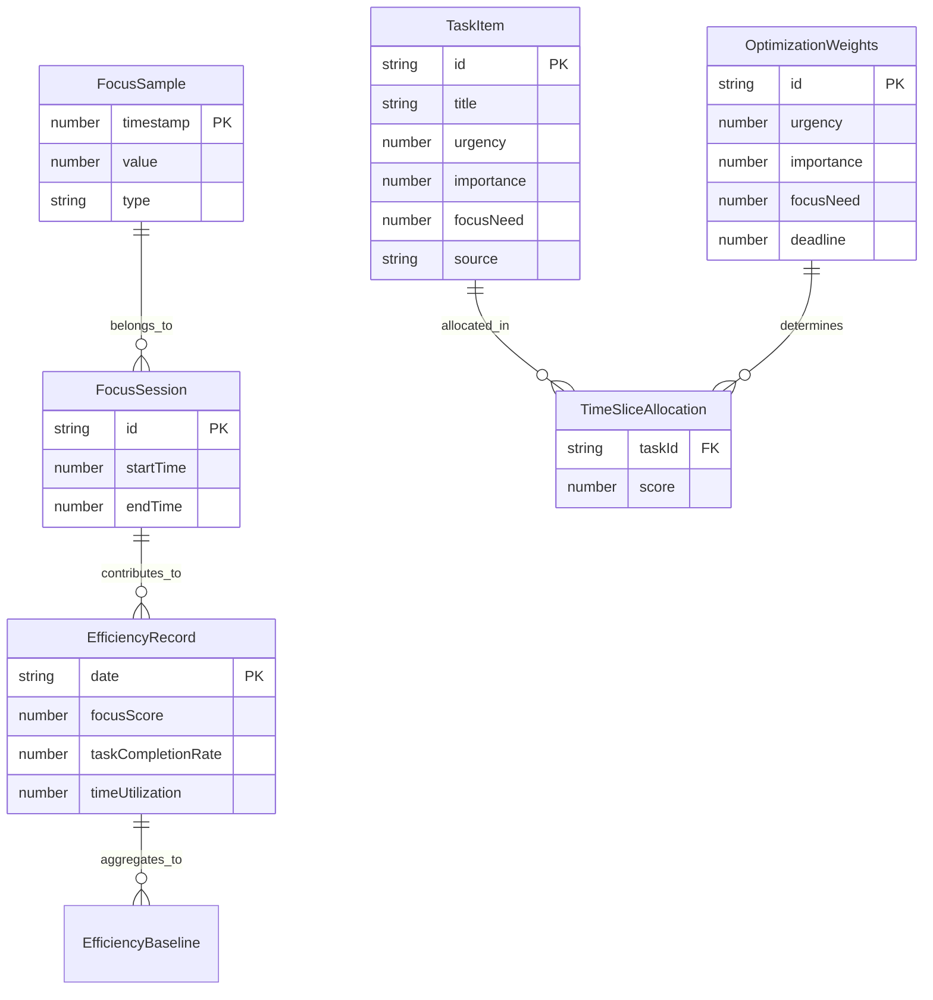

## 1. 架构设计



## 2. 技术说明
- **前端框架**：SolidJS + Solid Router + Solid Start
- **样式方案**：TailwindCSS 4 + CSS Variables 主题系统
- **构建工具**：Vite
- **图表渲染**：Canvas API（专注力波形）+ SVG（效能图表）+ 自研轻量图表组件
- **数据持久化**：IndexedDB（通过 idb-keyval 封装）
- **状态管理**：SolidJS Signals + Stores（无需额外状态库）
- **动画**：CSS Animations + Web Animations API
- **后端**：无（纯前端应用，所有数据本地存储）

## 3. 路由定义
| 路由 | 用途 |
|------|------|
| `/` | 效能驾驶舱 - 系统主页面 |
| `/focus` | 专注力动能 - 实时专注数据采集与可视化 |
| `/matrix` | 任务映射矩阵 - 任务优先级与跨系统映射 |
| `/atlas` | 效能图谱 - 长周期效能分析与基线报告 |

## 4. API 定义（无后端，纯前端数据模型）

### 4.1 核心数据类型

```typescript
interface FocusSample {
  timestamp: number
  value: number
  type: "deep" | "moderate" | "distracted" | "idle"
}

interface TaskItem {
  id: string
  title: string
  urgency: number
  importance: number
  focusNeed: number
  deadline: number | null
  estimatedMinutes: number
  source: "work" | "personal"
  status: "pending" | "active" | "completed" | "deferred"
  recommendedSlot: TimeSlot | null
  createdAt: number
  completedAt: number | null
}

interface TimeSlot {
  start: number
  end: number
  quality: "peak" | "normal" | "low"
}

interface FocusSession {
  id: string
  startTime: number
  endTime: number | null
  samples: FocusSample[]
  deepFocusIntervals: Array<{ start: number; end: number }>
  distractions: Array<{ timestamp: number; type: string; note?: string }>
}

interface EfficiencyRecord {
  date: string
  focusScore: number
  taskCompletionRate: number
  timeUtilization: number
  rhythmStability: number
  recoveryEfficiency: number
  totalDeepFocusMinutes: number
  totalTasksCompleted: number
}

interface OptimizationWeights {
  urgency: number
  importance: number
  focusNeed: number
  deadline: number
}

interface TimeSliceAllocation {
  taskId: string
  slot: TimeSlot
  score: number
  factors: Record<string, number>
}
```

### 4.2 IndexedDB 存储结构
| 存储名称 | 键 | 数据类型 | 用途 |
|----------|-----|----------|------|
| `focus_samples` | timestamp | FocusSample | 专注力采样原始数据 |
| `focus_sessions` | id | FocusSession | 专注会话记录 |
| `tasks` | id | TaskItem | 任务数据 |
| `efficiency_records` | date | EfficiencyRecord | 每日效能记录 |
| `optimization_weights` | id | OptimizationWeights | 优化模型权重配置 |
| `allocations` | date | TimeSliceAllocation[] | 每日时间片分配方案 |

## 5. 服务端架构（无后端）

本系统为纯前端应用，所有计算与存储均在浏览器端完成。

## 6. 数据模型

### 6.1 数据模型关系图



### 6.2 核心算法：异步多因子时间片分配优化模型

```
评分函数：
  Score(task, slot) = w₁ × Urgency_norm(task) 
                    + w₂ × Importance_norm(task)
                    + w₃ × FocusMatch(task, slot)
                    + w₄ × DeadlineProximity(task)

其中：
  FocusMatch(task, slot) = |task.focusNeed - slot.quality_score| 的反向映射
  slot.quality_score 基于历史专注力采样在该时段的统计值

约束条件：
  - 时间片不重叠
  - 高专注需求任务分配至历史高峰时段
  - 截止时间紧迫的任务优先保障分配
  - 每日总分配时间不超过可用工时
```
